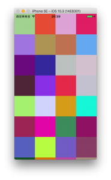

+++
title = "UICollectionView"
url = "2017-10-02"
date = "2017-10-02"
description = "UICollectionView"
tags = [
    "iOS",
]
categories = [
    "iOS",
]
archives = "2017/10"
aliases = ["migrate-from-jekyl"]
+++

 

UICollectionViewのサンプルです。  

[UICollectionViewを使う](http://docs.fabo.io/swift/uikit/053_uicollectionview.html) を参考にさせていただきました。  
このサイトは見やすくて、swiftをやる人にとてもオススメです。  

`makeColor()` 関数でランダムに生成した色をセルに入れています。  
スクロールするたびに色が変わります。  

<!-- Google Ads -->


<!-- Amazon Ads -->



