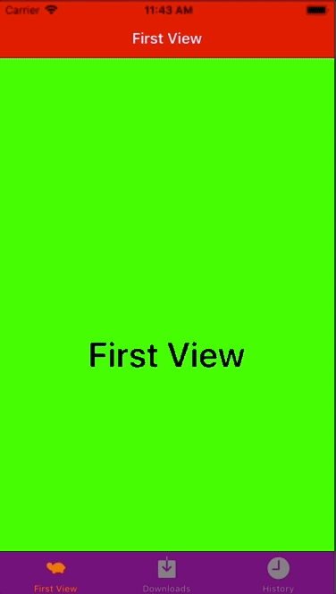

+++
title = "UITabBarControllerにUINavigationControllerを入れ子で実装する"
url = "2018-06-03"
date = "2018-06-03"
description = "UITabBarControllerにUINavigationControllerを入れ子で実装する"
tags = [
  "iOS",
]
categories = [
  "iOS",
]
archives = "2018/06"
aliases = ["migrate-from-jekyl"]
+++

 

UITabBarControllerにUINavigationControllerを入れるコードです。
UITabBarControllerにUINavigationBarControllerを入れて実装しています。

UITabBarControllerの実装はこちら。
NavigationControllerを実装する

<!-- Google Ads -->


<!-- Amazon Ads -->



