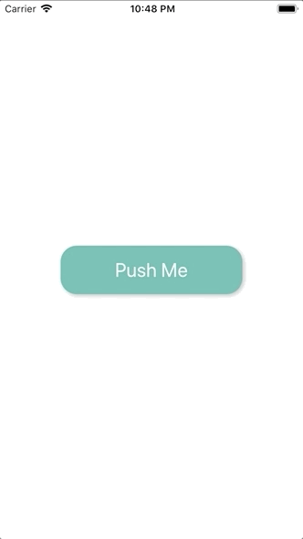

+++
title = "Lifesumアプリのインタラクションが素敵だったので再現してみた"
url = "2018-12-28"
date = "2018-12-28"
description = "Lifesumアプリのインタラクションが素敵だったので再現してみた"
tags = [
  "iOS",
]
categories = [
    "iOS",
]
archives = "2018/12"
aliases = ["migrate-from-jekyl"]
+++

 

#Swift4.2  
Lifesumというアプリの登録導線のインタラクションがとても素敵だったので再現してみました。  
インタラクションの凄さと登録導線離脱率の相関が気になりますね。  

<!-- Google Ads -->


<!-- Amazon Ads -->



