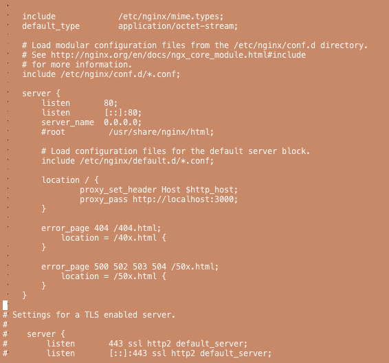

+++
title = "CentOS7にRailsをインストールする"
url = "2019-01-14"
date = "2019-01-14"
description = "Guide to emoji usage in Hugo"
tags = [
  "CentOS",
]
categories = [
    "Linux",
    "Ruby",
    "Rails",
]
archives = "2019/01"
aliases = ["migrate-from-jekyl"]
+++

 

CentOS7にRailsをインストールした時のメモになります。  
最終的なNginxの　nginx.conf ファイルはこちらになります。

