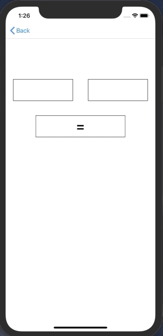

+++
title = "iOSでUITest（E2Eテスト）を行う(Swift5.0)"
url = "2019-04-11"
date = "2019-04-11"
description = "Guide to emoji usage in Hugo"
tags = [
    "iOS",
]
categories = [
    "iOS",
    "syntax",
]
archives = "2019/09"
aliases = ["migrate-from-jekyl"]
+++

 
Swift でUITest を行うサンプルコードです。  
左右のテキストフィールドに数字を入れ、ボタンを押すとその積を計算するアプリを作りました。  

そしてそのアプリのUITest を実装しました。  

参考: [【Swift】初めてのUITest導入](https://qiita.com/taji-taji/items/c00e5b94376c37f17443)

