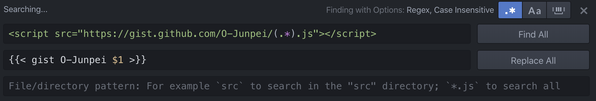

+++
title =  "HugoでGistが表示されない"
url = "2019-12-28"
date = "2019-12-28"
description = "HugoでGistが表示されない"
tags = [
    "Hugo"
]
categories = [
    "Hugo"
]
archives = "2019/12"
aliases = ["migrate-from-jekyl"]
+++

<br>

Hugo のバージョンを更新したところ、以下のような Gist のページが表示されなくなりました。

```
<script src="https://gist.github.com/O-Junpei/5aba51305d74c009a2c878897837e006.js"></script>
```

以下のように書き換えることで動作しました。

```

```

参考: [Shortcodes](https://gohugo.io/content-management/shortcodes/)

<!-- for swiswiswift.com responsive -->
<script async src="https://pagead2.googlesyndication.com/pagead/js/adsbygoogle.js"></script>
<ins class="adsbygoogle"
     style="display:block"
     data-ad-client="ca-pub-5587141252700968"
     data-ad-slot="1697863134"
     data-ad-format="auto"
     data-adtest="on"
     data-full-width-responsive="true"></ins>
<script>
     (adsbygoogle = window.adsbygoogle || []).push({});
</script>
<!-- for swiswiswift.com responsive -->

<!-- for swiswiswift-22 search -->
<script type="text/javascript">amzn_assoc_ad_type ="responsive_search_widget"; amzn_assoc_tracking_id ="swiswiswift-22"; amzn_assoc_marketplace ="amazon"; amzn_assoc_region ="JP"; amzn_assoc_placement =""; amzn_assoc_search_type = "search_widget";amzn_assoc_width ="auto"; amzn_assoc_height ="auto"; amzn_assoc_default_search_category =""; amzn_assoc_default_search_key ="";amzn_assoc_theme ="light"; amzn_assoc_bg_color ="FFFFFF"; </script><script src="//z-fe.amazon-adsystem.com/widgets/q?ServiceVersion=20070822&Operation=GetScript&ID=OneJS&WS=1&Marketplace=JP"></script>
<!-- for swiswiswift-22 search -->

置換は Atom の正規表現置換機能を使い一括置換を行いました。


