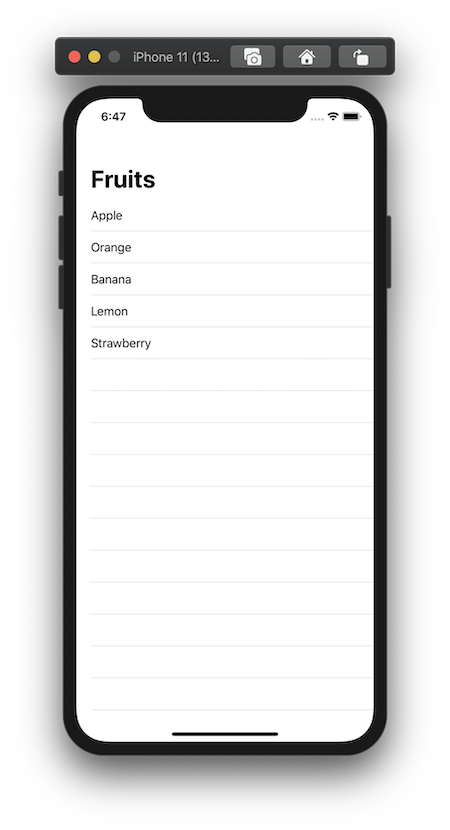

+++
title =  "SwiftUIでNavigationViewのタイトルやテーブルビューの背景を変える"
url = "2020-05-04"
date = "2020-05-04"
description = "SwiftUIでNavigationViewのタイトルやテーブルビューの背景を変える"
tags = [
    "Swift",
    "SwiftUI"
]
categories = [
    "Swift",
    "SwiftUI"
]
archives = "2020/05"
aliases = ["migrate-from-jekyl"]
+++

 

SwiftUIでNavigationViewのタイトルやテーブルビューの背景を変える方法です。
`TableView` と `UITextView` の `appearance` を変更しました。

<!-- Google Ads -->


<!-- Amazon Ads -->



