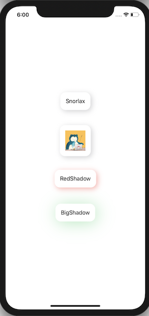

+++
title =  "ViewModifierを使ってViewに影をつける"
url = "2020-05-06"
date = "2020-05-06"
description = "ViewModifierを使ってViewに影をつける"
tags = [
    "Swift",
    "SwiftUI"
]
categories = [
    "Swift",
    "SwiftUI"
]
archives = "2020/05"
aliases = ["migrate-from-jekyl"]
+++

 

ViewModifierを使ってViewに影をつける方法です。
FunctionBuilderとViewModifier、どっちを使うか迷う時が良くあります。
関連してこちらもどうぞ。

[FunctionBuilderを使ってViewに影をつける](/2020-05-07/)

<!-- Google Ads -->


<!-- Amazon Ads -->



