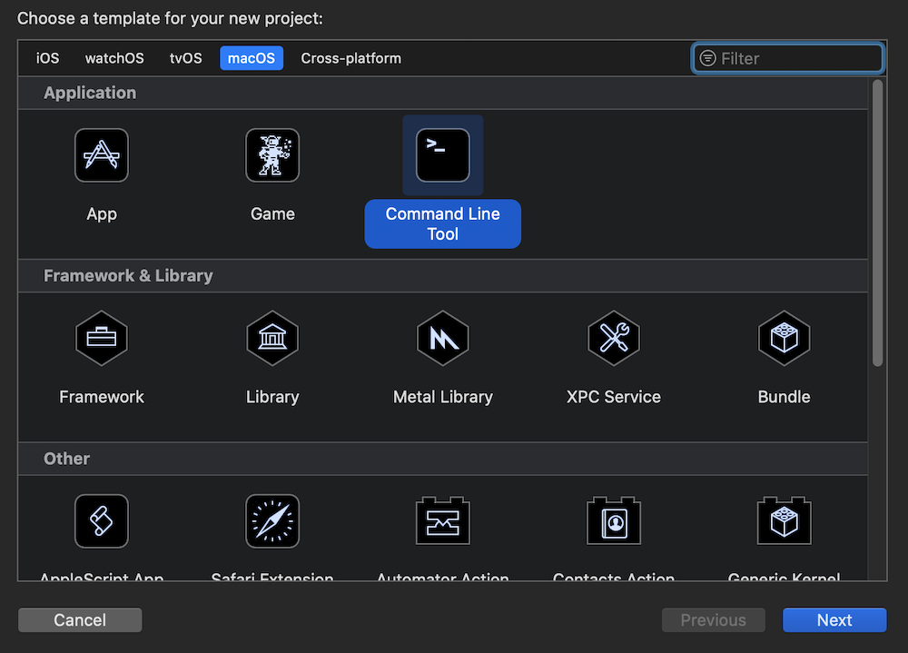
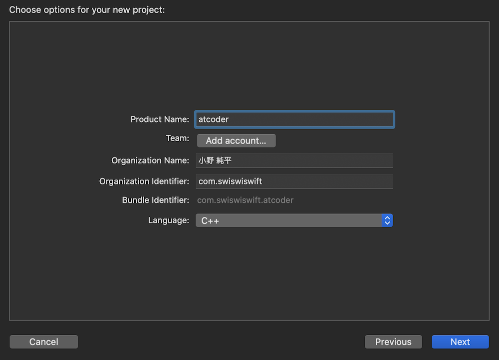

+++
title =  "XcodeでAtCoderをC++でやってみる"
url = "2020-06-02"
date = "2020-06-02"
description = "XcodeでAtCoderをC++でやってみる"
tags = [
    "AtCoder",
    "C++"
]
categories = [
    "AtCoder",
    "AtCoder"
]
archives = "2020/06"
aliases = ["migrate-from-jekyl"]
+++

 

XcodeでAtCoderをC++でやってみました。
AppStore から Xcode をインストールし、Create a new Xcode project で macOS の Command Line Tool を選択して新しいプロジェクトを作成します。

言語は C++ を選択します。

これで C++ を書き始めることが出来ました。
試しに [ABC-88-B - Card Game for Two](https://atcoder.jp/contests/abc088/tasks/abc088_b) を解いてみました。

AtCoder 楽しいですね！

<!-- Google Ads -->


<!-- Amazon Ads -->

