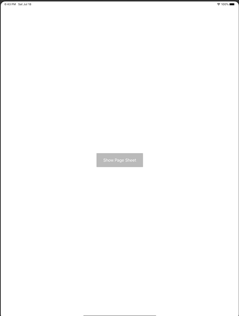

+++
title =  "iPadでモーダルのサイズを取得する"
url = "2020-07-02"
date = "2020-07-02"
description = "iPadでモーダルのサイズを取得する"
tags = [
    "Swift",
    "iOS"
]
categories = [
    "Swift",
    "iOS"
]
archives = "2020/07"
aliases = ["migrate-from-jekyl"]
+++

 

iPadでモーダルのサイズを取得する方法です。
viewWillLayoutSubviews でモーダルのサイズを取得することができます。

<!-- Google Ads -->


<!-- Amazon Ads -->



