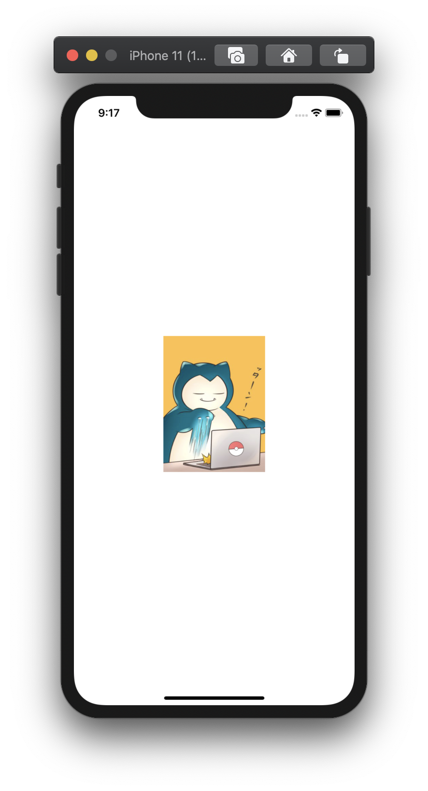

+++
title =  "画像をリサイズして表示（clip）"
url = "2020-09-06"
date = "2020-09-06"
description = "画像をリサイズして表示（clip）"
tags = [
  "SwiftUI",
  "iOS"
]
categories = [
  "SwiftUI",
  "iOS"
]
archives = "2020/09"
aliases = ["migrate-from-jekyl"]
+++

 

SwiftUIで画像をリサイズして表示します。
アスペクト比が異なる場合ははみ出た箇所を切り取って表示します。

<!-- Google Ads -->


<!-- Amazon Ads -->



