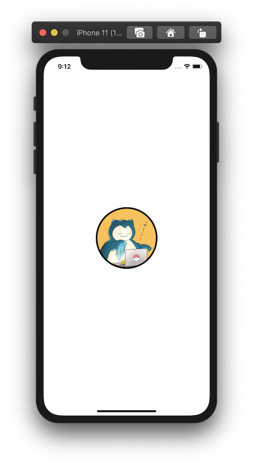

+++
title =  "画像を丸く切り取り、枠を付ける"
url = "2020-09-07"
date = "2020-09-07"
description = "画像を丸く切り取り、枠を付ける"
tags = [
  "SwiftUI",
  "iOS"
]
categories = [
  "SwiftUI",
  "iOS"
]
archives = "2020/09"
aliases = ["migrate-from-jekyl"]
+++

 

SwiftUIで画像を丸く切り取り、枠を付ける方法です。

<!-- Google Ads -->


<!-- Amazon Ads -->



