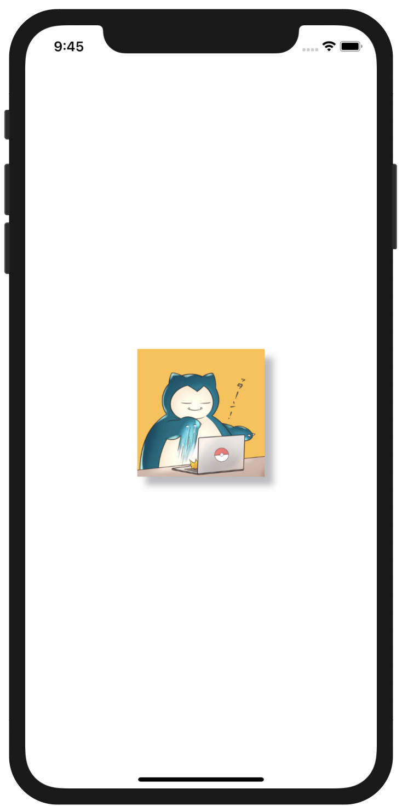

+++
title =  "SwiftUIでViewの周りに影をつける"
url = "2020-10-01"
date = "2020-10-01"
description = "SwiftUIでViewの周りに影をつける"
tags = [
  "SwiftUI",
  "iOS"
]
categories = [
  "SwiftUI",
  "iOS"
]
archives = "2020/10"
aliases = ["migrate-from-jekyl"]
+++

 

SwiftでUIViewの周りに影をつける方法です。
ImageのViewの周りに影をつけています。
`shadowOffset` で影の位置を移動させることができ、サンプルコードでは影を右下に移動させています。

<!-- Google Ads -->


<!-- Amazon Ads -->



