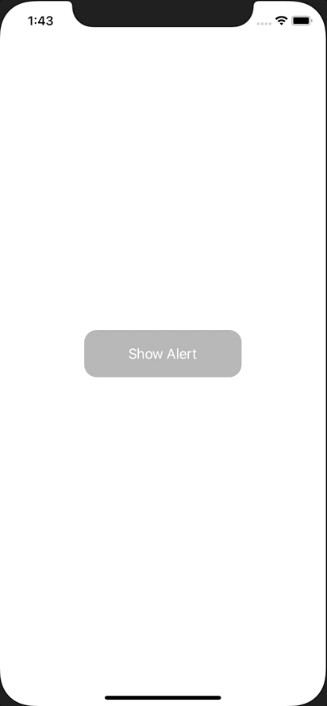

+++
title =  "UIAlertControllerの中でTextFieldを使う"
url = "2020-11-08"
date = "2020-11-08"
description = "UIAlertControllerの中でTextFieldを使う"
tags = [
  "Swift", "UIKit"
]
categories = [
  "Swift", "UIKit"
]
archives = "2020/11"
aliases = ["migrate-from-jekyl"]
+++

 

UIAlertControllerの中でTextFieldを使う方法です。
Alertの中でテキストを入力できます。

<!-- Google Ads -->


<!-- Amazon Ads -->



