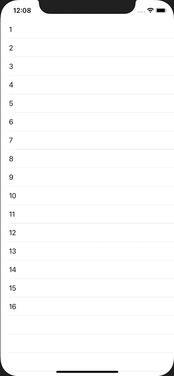

+++
title =  "TableViewでセルのロングタップを検出する"
url = "2020-11-10"
date = "2020-11-10"
description = "TableViewでセルのロングタップを検出する"
tags = [
  "Swift", "UIKit"
]
categories = [
  "Swift", "UIKit"
]
archives = "2020/11"
aliases = ["migrate-from-jekyl"]
+++

 

TableViewでセルのロングタップを検出する方法です。
通常のタップとロングタップをそれぞれのイベントとして取得することができます。

<!-- Google Ads -->


<!-- Amazon Ads -->



