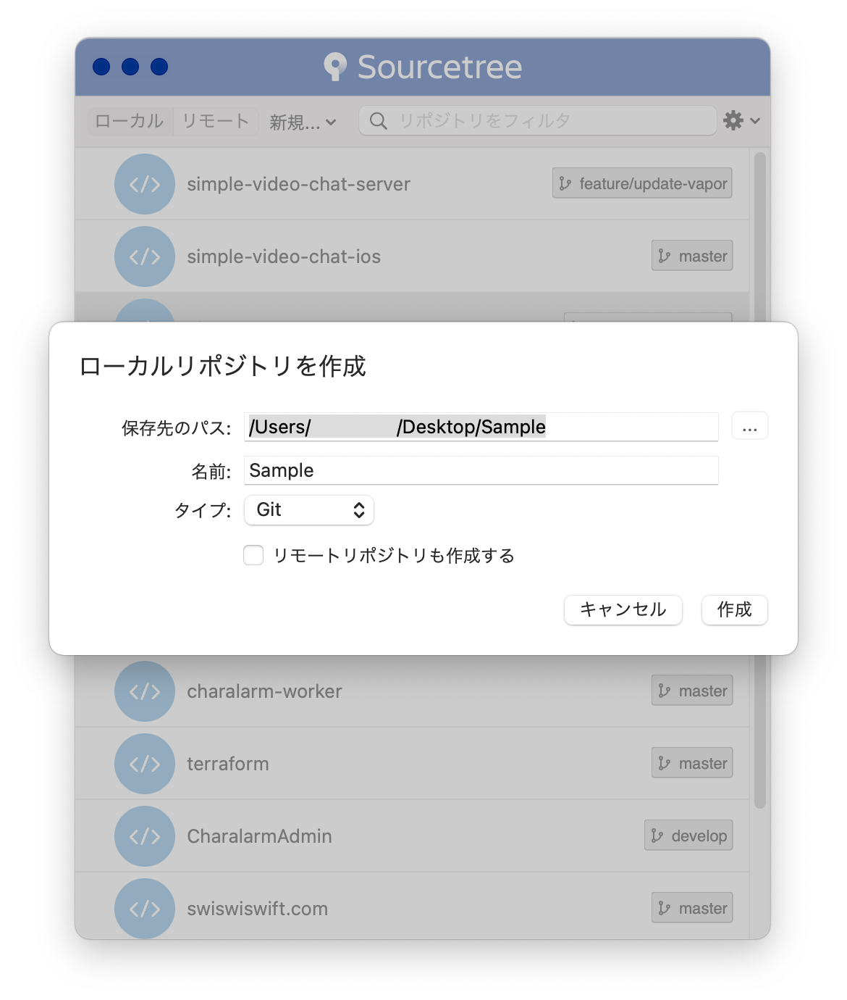

+++
title =  "Xcodeでプロジェクトを作成してGithubにプッシュする"
url = "2020-12-03"
date = "2020-12-03"
description = "Xcodeでプロジェクトを作成してGithubにプッシュする"
tags = [
  "Swift"
]
categories = [
  "Swift"
]
archives = "2020/12"
aliases = ["migrate-from-jekyl"]
+++

 

Xcodeでプロジェクトを作成してGithubにプッシュする忘備録です。

まずプロジェクトを作成します。

作成したプロジェクトのフォルダを SourceTree にドラッグアンドドロップします。

[gitignore.io](https://www.toptal.com/developers/gitignore)にアクセスして .gitignore ファイルを作成します。

新しいリポジトリを作ります。

<!-- Google Ads -->


<!-- Amazon Ads -->


矢印のURIをコピーします。

SourceTreeの設定からリモートリポジトリを追加します。コピーしたURIを貼り付けます。

