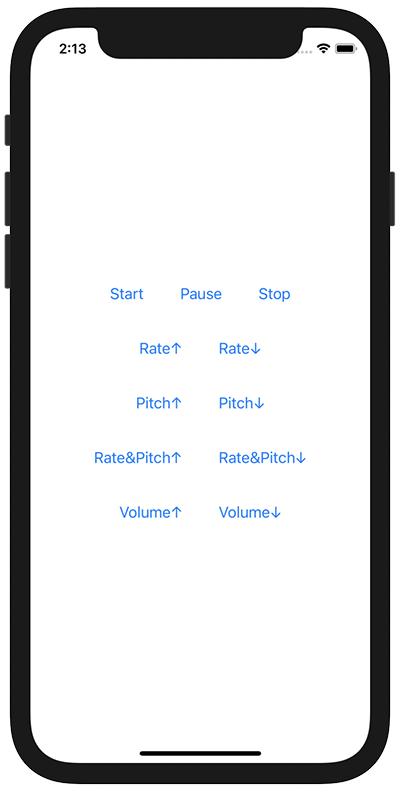

+++
title =  "AVAudioPlayerNodeを使って音楽の再生、一時停止、再生速度変更、ピッチ変更、ボリューム変更を行う"
url = "2020-12-09"
date = "2020-12-09"
description = "AVAudioPlayerNodeを使って音楽の再生、一時停止、再生速度変更、ピッチ変更、ボリューム変更を行う"
tags = [
  "Swift",
  "SwiftUI"
]
categories = [
  "Swift",
  "SwiftUI"
]
archives = "2020/12"
aliases = ["migrate-from-jekyl"]
+++

 

AVAudioPlayerNodeを使って音楽の再生、一時停止、再生速度変更、ピッチ変更、ボリューム変更を行う方法です。
AVAudioPlayerNodeはAVAudioPlayerではできないようなことができます。
たとえばピッチの変更などAVAudioPlayerでは実現することはできないので、AVAudioPlayerNodeを使う必要があります。

<!-- Google Ads -->


<!-- Amazon Ads -->



