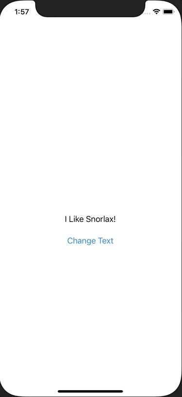

+++
title =  "@Stateと@Bindingの使い分け"
url = "2021-02-05"
date = "2021-02-05"
description = "@Stateと@Bindingの使い分け"
tags = [
  "iOS",
  "SwiftUI"
]
categories = [
  "iOS",
  "SwiftUI"
]
archives = "2020/02"
aliases = ["migrate-from-jekyl"]
+++

 

@Stateと@Bindingの使い分けについです。

@State のついた変数を変更することでViewにその変更が反映されます。
以下の例ではボタンを押すことで 変数textの値を変えています。
変数textの値を変えることでその変更が反映され、文字列が変わります。

<!-- Google Ads -->




<!-- Amazon Ads -->


@Binding は親のViewのプロパティを子のViewで変えたい時に使います。
ContentViewでは変数textの値を表示しています。
ChangeTextボタンを押してSecondViewに遷移し、そこで値を変えると親である ContentView のプロパティも変更され、画面にその変更が反映されています。



