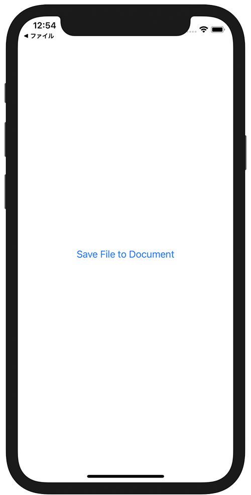

+++
title =  "iOSのファイルアプリを開いてドキュメントフォルダに保存したファイルを開く"
url = "2021-06-02"
date = "2021-06-02"
description = "iOSのファイルアプリを開いてドキュメントフォルダに保存したファイルを開く"
tags = [
  "SwiftUI"
]
categories = [
  "SwiftUI"
]
archives = "2021/06"
aliases = ["migrate-from-jekyl"]
+++

 

iOSのファイルアプリを開いてドキュメントフォルダに保存したファイルを開く方法です。

アプリのドキュメントディレクトリにファイルを保存するアプリを書きます。



<!-- Amazon Ads -->


<!-- Google Ads -->


次に `info.plist` にファイルアプリでドキュメントディレクトリを開けるように設定を追加します。

