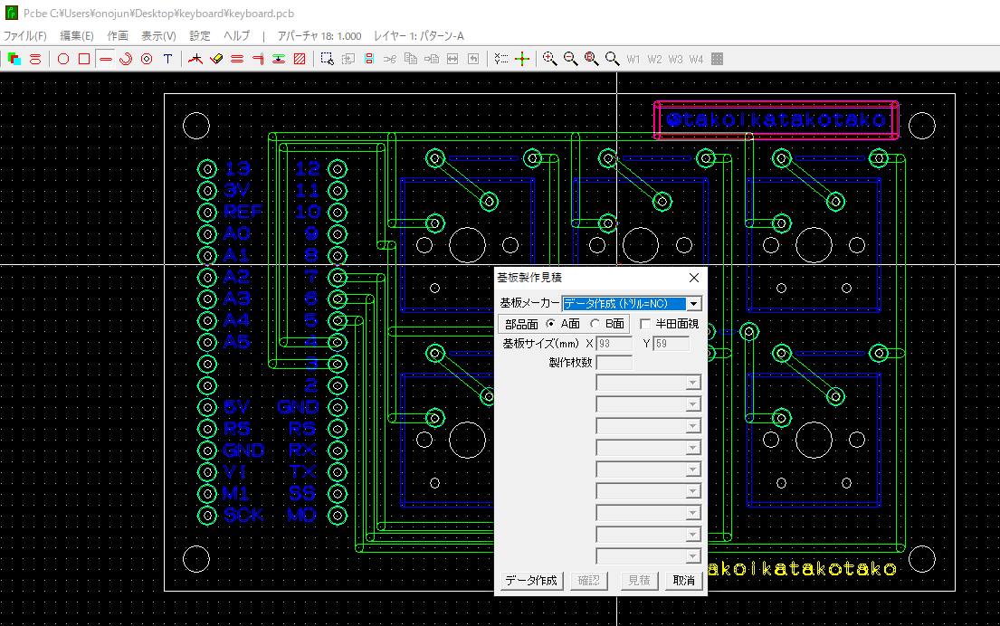
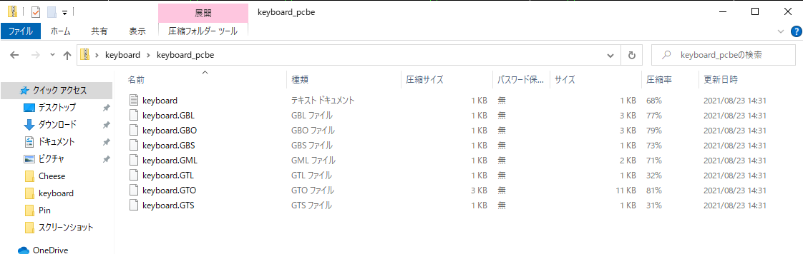

+++
title =  "PCBEで作った基板をPCBGOGOで注文する"
url = "2021-09-05"
date = "2021-09-05"
description = "PCBEで作った基板をPCBGOGOで注文する"
tags = [
  "PCBE"
]
categories = [
  "PCBE"
]
archives = "2021/09"
aliases = ["migrate-from-jekyl"]
+++

 

PCBEで作った基板をPCBGOGOで注文する方法です。
ファイル -> 基盤見積もり作成 -> 画像のように「データ作成（ドリル=NC）」を選択 -> データ作成　を選択。
作成された zip ファイルを PCBGOGO に送れば大丈夫でした。

参考: [PCBEからガーバーファイルを出力する方法](https://www.fusionpcb.jp/blog/?p=1094)

<!-- Amazon Ads -->


<!-- Google Ads -->


このような中身の zip ファイルが作成されます。

