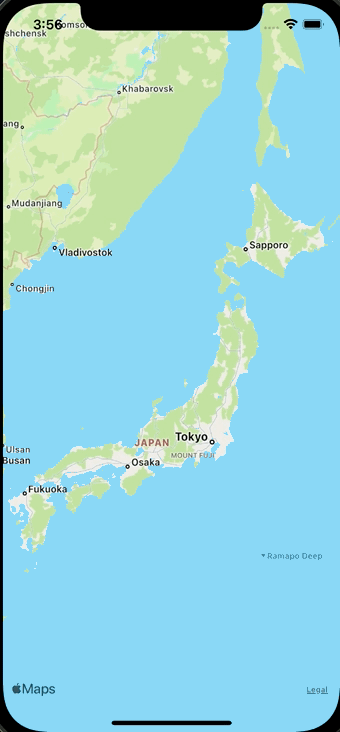

+++
title =  "MapViewのタップした箇所に黒丸を描画する"
url = "2021-10-01"
date = "2021-10-01"
description = "MapViewのタップした箇所に黒丸を描画する"
tags = [
  "iOS"
]
categories = [
  "iOS"
]
archives = "2021/10"
aliases = ["migrate-from-jekyl"]
+++

 

MapViewのタップした箇所に黒丸を描画する方法です。
タップした箇所に黒丸を描画しています。黒丸のサイズは地図に対して相対的ではなく絶対的（地図を拡大すると黒丸も大きくなる）になります。

<!-- Amazon Ads -->


<!-- Google Ads -->




