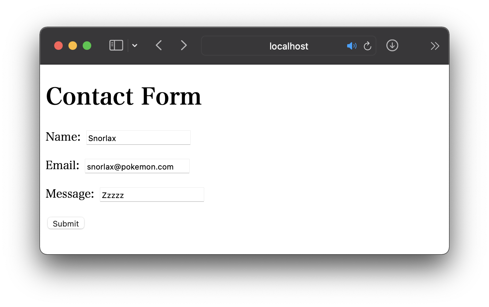
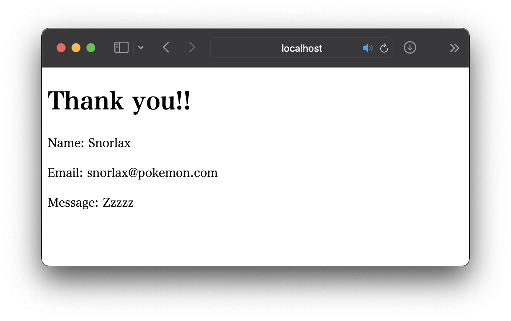
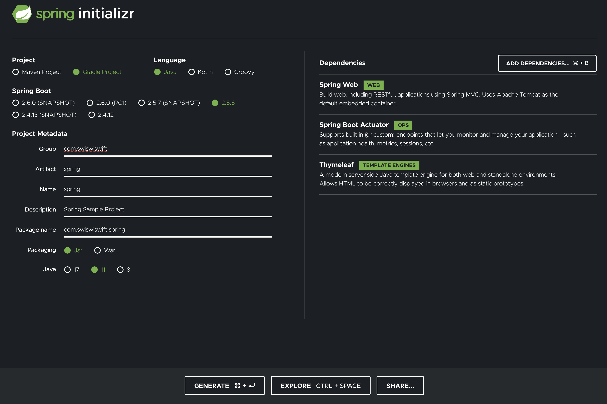

+++
title =  "Springを使ってお問い合わせフォームを作るその１"
url = "2021-10-04"
date = "2021-10-04"
description = "Springを使ってお問い合わせフォームを作るその１"
tags = [
  "Java",
  "Spring"
]
categories = [
  "Java",
  "Spring"
]
archives = "2021/10"
aliases = ["migrate-from-jekyl"]
+++

<br>

Springを使ってお問い合わせフォームを作ります。
ユーザーがフォームにお問い合わせ内容を書いて投稿することができ、それを一覧で確認できるシステムを作ります。`localhost:8080/form` にアクセスするとフォームが表示され、入力後に投稿ボタンを押すとお礼メッセージと投稿内容が表示されます。




Spring Initilizer を使ってプロジェクトを作成します。
`Spring Web`, `Spring Boot Actuator`, `Thymeleaf` を追加し、プロジェクトを作成します。
作成したプロジェクトを IntelliJ で開き問題なく起動することを確認します。



`ContactForm.java` というファイルを作成します。
このファイルは Data Transfer Object（DTO）と呼ばれる種類のファイルで、ひとまとまりのデータを受け渡す時に便利なファイルです。

```java
package com.swiswiswift.spring;

public class ContactForm {
    private String name;
    private String email;
    private String message;

    public String getName() {
        return name;
    }
    public void setName(String name) {
        this.name = name;
    }
    
    // ...略
}
```

`form.html` を作成します。`localhost:8080/form` へアクセスがあった場合表示されるフォームです。

```html
<!DOCTYPE HTML>
<html xmlns:th="https://www.thymeleaf.org">
<head>
    <title>Form</title>
    <meta http-equiv="Content-Type" content="text/html; charset=UTF-8"/>
</head>
<body>
<h1>Contact Form</h1>
<form action="#" th:action="@{/form/result}" th:object="${form}" method="post">
    <p>Name: <input type="text" th:field="*{name}"/></p>
    <p>Email: <input type="text" th:field="*{email}"/></p>
    <p>Message: <input type="text" th:field="*{message}"/></p>
    <p><input type="submit" value="Submit"/></p>
</form>
</body>
</html>
```

`MyController` を作成します。`localhost:8080/form` へアクセスしたら `form.html` を表示するさせます。ここで `localhost:8080/form` へアクセスするとフォームが表示されることを確認します。

```
package com.swiswiswift.spring;

import org.springframework.stereotype.Controller;
import org.springframework.ui.Model;
import org.springframework.web.bind.annotation.GetMapping;
import org.springframework.web.bind.annotation.ModelAttribute;
import org.springframework.web.bind.annotation.PostMapping;

@Controller
public class MyController {
    @GetMapping("/form")
    public String getForm(Model model) {
        model.addAttribute("form", new ContactForm());
        return "form";
    }
}
```

投稿完了時に表示される `result.html` を作成します。

```html
<!DOCTYPE HTML>
<html xmlns:th="https://www.thymeleaf.org">
<head>
    <title>Form Result</title>
    <meta http-equiv="Content-Type" content="text/html; charset=UTF-8"/>
</head>
<body>
<h1>Thank you!!</h1>
<p th:text="'Name: ' + ${form.name}"></p>
<p th:text="'Email: ' + ${form.email}"></p>
<p th:text="'Message: ' + ${form.message}"></p>
</body>
</html>
```

`MyController`　にメソッドを追加します。

```java
@PostMapping("/form/result")
public String getFormResult(@ModelAttribute ContactForm form, Model model) {
    model.addAttribute("form", form);
    return "result";
}
```

これで完成です。`localhost:8080/form` にアクセスするとフォームが表示され、入力後に投稿ボタンを押すとお礼メッセージと投稿内容が表示されます。
コードの全文はこちらです。


