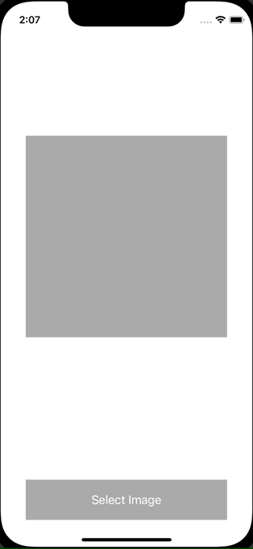

+++
title =  "PHPickerViewControllerを使って画像を選択する"
url = "2021-11-05"
date = "2021-11-05"
description = "PHPickerViewControllerを使って画像を選択する"
tags = [
  "iOS",
  "UIKit"
]
categories = [
  "iOS",
  "UIKit"
]
archives = "2021/11"
aliases = ["migrate-from-jekyl"]
+++

 

PHPickerViewController を使って画像を選択する方法です。
UIImagePickerController が将来的に非推奨になり PHPickerViewController に置き換わっていくみたいです。

参考: [Meet the new Photos picker](https://developer.apple.com/videos/play/wwdc2020/10652/)

<!-- Amazon Ads -->


<!-- Google Ads -->



