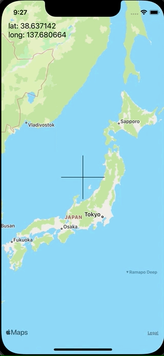

+++
title =  "SwiftUIでMapViewの中央に十字を用意し、その中央の座標を取得する"
url = "2021-12-05"
date = "2021-12-05"
description = "SwiftUIでMapViewの中央に十字を用意し、その中央の座標を取得する"
tags = [
  "SwiftUI",
  "Swift"
]
categories = [
  "SwiftUI",
  "Swift"
]
archives = "2021/12"
aliases = ["migrate-from-jekyl"]
+++

 

SwiftUIでMapViewの中央に十字を用意し、その中央の座標を取得する方法です。
MapViewが動いたタイミングでラベルの文字列が更新されます。

<!-- Amazon Ads -->


<!-- Google Ads -->




