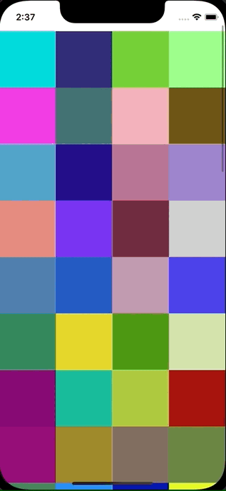

+++
title =  "UICollectionViewのサンプル"
url = "2022-02-02"
date = "2022-02-02"
description = "UICollectionViewのサンプル"
tags = [
  "iOS",
  "Swift"
]
categories = [
  "iOS",
  "Swift"
]
archives = "2022/02"
aliases = ["migrate-from-jekyl"]
+++

 

UICollectionViewのサンプルです。
makeColor() 関数でランダムに生成した色をセルに入れています。
スクロールするたびに色が変わります。

<!-- Amazon Ads -->


<!-- Google Ads -->




