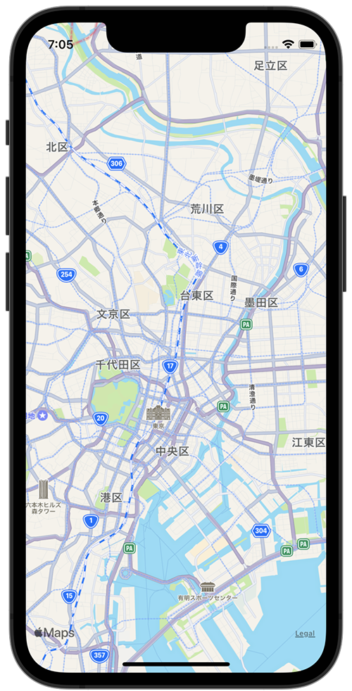

+++
title =  "MKMapViewの表示範囲を設定する"
url = "2022-02-05"
date = "2022-02-05"
description = "MKMapViewの表示範囲を設定する"
tags = [
  "iOS",
  "Swift"
]
categories = [
  "iOS",
  "Swift"
]
archives = "2022/02"
aliases = ["migrate-from-jekyl"]
+++

 

MKMapViewの表示範囲を設定する方法です。
秋葉原駅（35.6984, 139.7731）を中心として緯度経度が±0.1となるように表示されます。

参考: [【Swift】MapKitで経由地点を含めたルートディレクションの表示方法](https://orangelog.site/swift/mapkit-waypoints-route-direction/)

<!-- Amazon Ads -->


<!-- Google Ads -->




