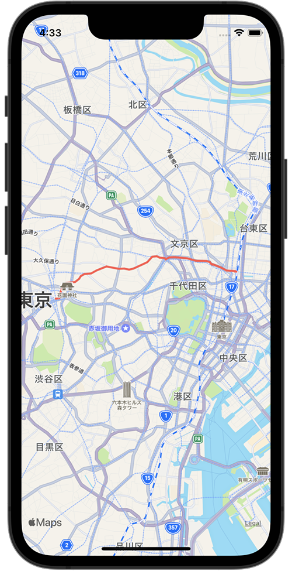

+++
title =  "MKMapViewで経路を表示する"
url = "2022-02-06"
date = "2022-02-06"
description = "MKMapViewで経路を表示する"
tags = [
  "iOS",
  "Swift"
]
categories = [
  "iOS",
  "Swift"
]
archives = "2022/02"
aliases = ["migrate-from-jekyl"]
+++

 

MKMapViewで経路を表示する方法です。
新宿駅から秋葉原駅への経路を表示しています。

参考: [【Swift】MapKitで経由地点を含めたルートディレクションの表示方法](https://orangelog.site/swift/mapkit-waypoints-route-direction/)

<!-- Amazon Ads -->


<!-- Google Ads -->




