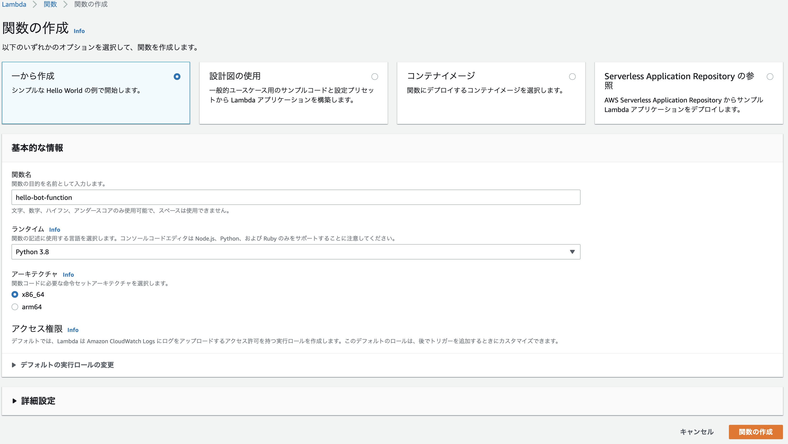

+++
title =  "LambdaとEvent BridgeでDiscordの目覚ましBotを作る"
url = "2022-02-07"
date = "2022-02-07"
description = "LambdaとEvent BridgeでDiscordの目覚ましBotを作る"
tags = [
  "AWS"
]
categories = [
  "AWS"
]
archives = "2022/02"
aliases = ["migrate-from-jekyl"]
+++

<br>

LambdaとEvent BridgeでDiscordの目覚ましBotを作る方法です。
「おはよう」と毎朝つぶやくDiscordのBotを作ります。

まずDiscordでウェブフックを作成します。
curlコマンドを使い、メッセージが届くことを確認します。

```
export WEBHOOK_URL="https://discord.com/api/webhooks/xxx/xxx"
curl \
  -H "Content-Type: application/json" \
  -d '{"username": "おはようBot", "content": "おはようございます。"}' \
  $WEBHOOK_URL
```

届いたことを確認したら上記curl文をPythonで書き換えます。
これをLambdaに載っけます。

```
import urllib.request
import json

def main():
    url = 'https://discord.com/api/webhooks/xxx/xxx'
    message = {'username': 'おはようBot', 'content' : 'おはようございます！'}
    data = json.dumps(message).encode("utf-8")
    request = urllib.request.Request(
        url = url,
        data = data,
        headers = {"User-Agent": "lambda/python", "Content-Type" : "application/json"},
        method = 'POST'
    )
    with urllib.request.urlopen(request) as response:
        response_body = response.read().decode("utf-8")
        print(response_body)


def lambda_handler(event, context):
    main()

if __name__ == '__main__':
    main()
```


MKMapViewで経路を表示する方法です。
新宿駅から秋葉原駅への経路を表示しています。



参考: [【Swift】MapKitで経由地点を含めたルートディレクションの表示方法](https://orangelog.site/swift/mapkit-waypoints-route-direction/)


<!-- Amazon Ads -->


<!-- Google Ads -->




