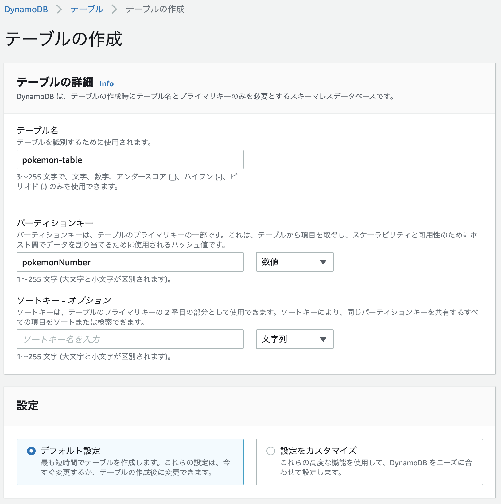
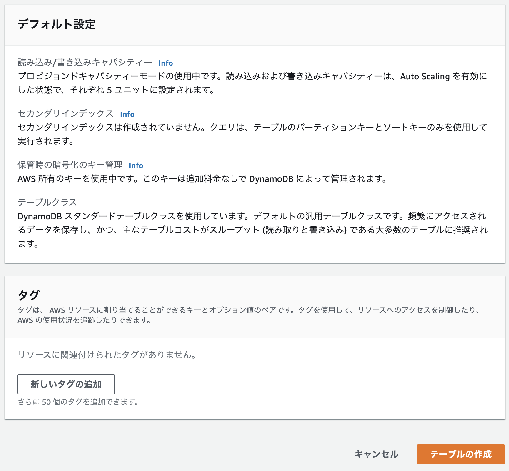
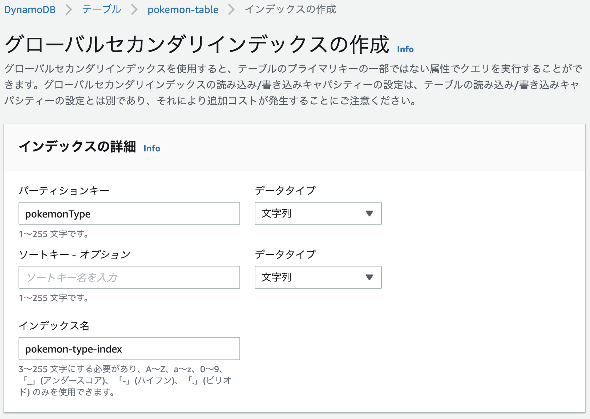

+++
title =  "AWS CLIでDynamoDBを操作する"
url = "2022-03-06"
date = "2022-03-06"
description = "AWS CLIでDynamoDBを操作する"
tags = [
  "AWS"
]
categories = [
  "AWS"
]
archives = "2022/03"
aliases = ["migrate-from-jekyl"]
+++

<br>

AWS CLIでDynamoDBを操作する方法です。

AWS マネジメントコンソールから `pokemon-table` という名前でテーブルを作ります。
`pokemonNumber` というパーテーションキーを数字型設定しました。






### list-tables

テーブル一覧を表示します。

```
aws dynamodb list-tables | jq
```

```
{
  "TableNames": [
    "pokemon-table"
  ]
}
```


### describe-table

テーブル詳細を表示します。

```
aws dynamodb describe-table \
--table-name pokemon-table | jq
```

```
{
  "Table": {
    "AttributeDefinitions": [
      {
        "AttributeName": "pokemonNumber",
        "AttributeType": "N"
      }
    ],
    "TableName": "pokemon-table",
    "KeySchema": [
      {
        "AttributeName": "pokemonNumber",
        "KeyType": "HASH"
      }
    ],
    "TableStatus": "ACTIVE",
    "CreationDateTime": "2022-03-14T08:50:51.248000+09:00",
    "ProvisionedThroughput": {
      "NumberOfDecreasesToday": 0,
      "ReadCapacityUnits": 5,
      "WriteCapacityUnits": 5
    },
    "TableSizeBytes": 0,
    "ItemCount": 0,
    "TableArn": "arn:aws:dynamodb:ap-northeast-1:xxxxxxxxxxxx:table/pokemon-table",
    "TableId": "20804895-068c-4096-8b9d-0dada0bdeeb1"
  }
}
```


### put-item

テーブルにアイテムを追加します。

```
aws dynamodb put-item \
--table-name pokemon-table \
--item '{ "pokemonNumber": { "N": "143" }, "pokemonName": { "S": "Snorlax" }, "pokemonType": { "S": "Normal" } }'
```

```
aws dynamodb put-item \
--table-name pokemon-table \
--item '{ "pokemonNumber": { "N": "25" }, "pokemonName": { "S": "Pikachu" }, "pokemonType": { "S": "Electric" } }'
```

```
aws dynamodb put-item \
--table-name pokemon-table \
--item '{ "pokemonNumber": { "N": "132" }, "pokemonName": { "S": "Ditto" }, "pokemonType": { "S": "Normal" } }'
```

```
aws dynamodb put-item \
--table-name pokemon-table \
--item '{ "pokemonNumber": { "N": "133" }, "pokemonName": { "S": "Eevee" }, "pokemonType": { "S": "Normal" } }'
```

```
aws dynamodb put-item \
--table-name pokemon-table \
--item '{ "pokemonNumber": { "N": "4" }, "pokemonName": { "S": "Charmander" }, "pokemonType": { "S": "Fire" } }'
```

```
aws dynamodb put-item \
--table-name pokemon-table \
--item '{ "pokemonNumber": { "N": "60" }, "pokemonName": { "S": "Poliwag" }, "pokemonType": { "S": "Water" } }'
```


### get-item

パーテーションキー（今回の場合はポケモンの番号）を使ってアイテムを取得します。

```
aws dynamodb get-item \
--table-name pokemon-table \
--key '{ "pokemonNumber": { "N": "143" } }' | jq
```

```
{
  "Item": {
    "pokemonName": {
      "S": "Snorlax"
    },
    "pokemonNumber": {
      "N": "143"
    },
    "pokemonType": {
      "S": "Normal"
    }
  }
}
```


### scan

任意のアイテムを取得します。
全てのアイテムに対して検索をかけるのでアイテムが多い場合はお金がかかるので、基本は後述の query を使った方が良さそうです。

アイテムを全て取得します。

```
aws dynamodb scan \
--table-name pokemon-table | jq
```

スキャンを使ってノーマルタイプのポケモンを検索します。

```
aws dynamodb scan \
--table-name pokemon-table \
--filter-expression 'pokemonType = :pokemonType' \
--expression-attribute-values '{ ":pokemonType": { "S": "Normal" } }' | jq
```

スキャンを使ってノーマルタイプのポケモンを1件検索します。

```
aws dynamodb scan \
--table-name pokemon-table \
--filter-expression 'pokemonType = :pokemonType' \
--expression-attribute-values '{ ":pokemonType": { "S": "Normal" } }' \
--limit 1 | jq
```

スキャンを使ってポケモン番号が100以上のポケモンを検索します。

```
aws dynamodb scan \
--table-name pokemon-table \
--filter-expression 'pokemonNumber >= :pokemonNumber' \
--expression-attribute-values '{ ":pokemonNumber": { "N": "100" } }' | jq
```

スキャンを使ってノーマルタイプかつ名前がSnorlaxのポケモンを検索します。

```
aws dynamodb scan \
--table-name pokemon-table \
--filter-expression 'pokemonType = :pokemonType AND pokemonName = :pokemonName' \
--expression-attribute-values '{ ":pokemonType": { "S": "Normal" }, ":pokemonName": { "S": "Snorlax" } }' | jq
```

クエリを分けて書くこともできます。

```
aws dynamodb scan \
--table-name pokemon-table \
--filter-expression 'pokemonType = :pokemonType' \
--expression-attribute-values '{ ":pokemonType": { "S": "Normal" } }' \
--filter-expression 'pokemonName = :pokemonName' \
--expression-attribute-values '{ ":pokemonName": { "S": "Snorlax" } }' | jq
```


スキャンを使ってノーマルタイプかつポケモン番号が100以上を検索します。

```
aws dynamodb scan \
--table-name pokemon-table \
--filter-expression 'pokemonNumber >= :pokemonNumber AND pokemonType = :pokemonType' \
--expression-attribute-values '{ ":pokemonNumber": { "N": "100" }, ":pokemonType": { "S": "Normal" } }' | jq
```

スキャンを使ってほのおタイプ、または電気タイプのポケモンを探します。

```
aws dynamodb scan \
--table-name pokemon-table \
--filter-expression 'pokemonType = :electricType OR pokemonType = :fireType' \
--expression-attribute-values '{ ":electricType": { "S": "Electric" }, ":fireType": { "S": "Fire" } }' | jq
```


### グローバルセカンダリインデックス

クエリで任意のパラメーターを使うにはグローバルセカンダリインデックスを使う必要があります。
ポケモンのタイプのグローバルセカンダリインデックスを作成します。




### Query

```
aws dynamodb query \
--table-name pokemon-table \
--key-condition-expression "pokemonNumber = :pokemonNumber" \
--expression-attribute-values  '{ ":pokemonNumber" : { "N" : "143" } }' | jq
```

```
aws dynamodb query \
--table-name pokemon-table \
--index-name pokemon-type-index	\
--key-condition-expression "pokemonType = :pokemonType" \
--expression-attribute-values '{ ":pokemonType": { "S": "Normal" } }' | jq
```


### PartiQL for DynamoDB

SQL互換のクエリ言語のPartiQLを使うことでSQLを実行することができます。

ポケモン番号が143のポケモンを探します。

```
aws dynamodb execute-statement \
--statement \
"SELECT * FROM \"pokemon-table\" WHERE pokemonNumber=143" | jq
```

ノーマルタイプのポケモンを探します。

```
aws dynamodb execute-statement \
--statement \
"SELECT * FROM \"pokemon-table\" WHERE pokemonType='Normal'" | jq
```

Snorlaxという名前のポケモンを探します。

```
aws dynamodb execute-statement \
--statement \
"SELECT * FROM \"pokemon-table\" WHERE pokemonName='Snorlax'" | jq
```

Snorlaxという名前のポケモンを探します。こちらはグローバルセカンダリインデックスを使用します。

```
aws dynamodb execute-statement \
--statement \
"SELECT * FROM \"pokemon-table\".\"pokemon-type-index\" WHERE pokemonType='Normal'" | jq
```


### update-item

まず更新前のアイテムを確認します。
```
aws dynamodb get-item \
--table-name pokemon-table \
--key '{ "pokemonNumber": { "N": "143" } }' | jq
```

アイテムを更新します。

```
aws dynamodb update-item \
--table-name pokemon-table \
--key '{ "pokemonNumber": { "N": "143" } }' \
--update-expression 'set pokemonName = :pokemonName' \
--expression-attribute-values '{ ":pokemonName": { "S": "Snorlax V" }  }' | jq
```

--return-values 'ALL_NEW' をつけると更新したアイテムが表示されます。

```
aws dynamodb update-item \
--table-name pokemon-table \
--key '{ "pokemonNumber": { "N": "143" } }' \
--update-expression 'set pokemonName = :pokemonName' \
--expression-attribute-values '{ ":pokemonName": { "S": "Snorlax V Max" }  }' \
--return-values 'ALL_NEW' | jq
```

```
{
  "Attributes": {
    "pokemonName": {
      "S": "Snorlax V Max"
    },
    "pokemonNumber": {
      "N": "143"
    },
    "pokemonType": {
      "S": "Normal"
    }
  }
}
```


### delete-item

アイテムを削除します。

```
aws dynamodb delete-item \
--table-name pokemon-table \
--key '{ "pokemonNumber": { "N": "143" } }'
```

# 参考記事
https://www.wakuwakubank.com/posts/675-aws-cli-dynamodb/

https://dynobase.dev/dynamodb-cli-query-examples/#query-with-sorting

https://dev.classmethod.jp/articles/partiql-for-dynamodb-example/

https://qiita.com/ekzemplaro/items/93c0aef433a2b633ab4a

https://docs.aws.amazon.com/amazondynamodb/latest/developerguide/

getting-started-step-7.html
