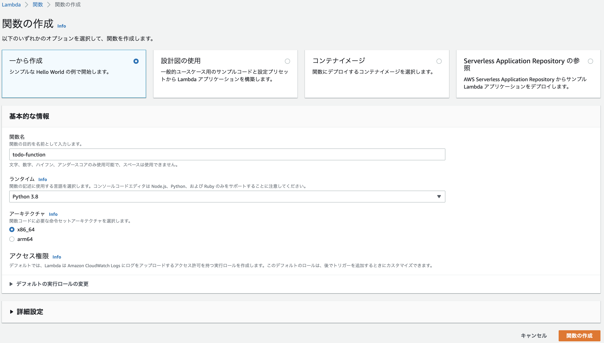
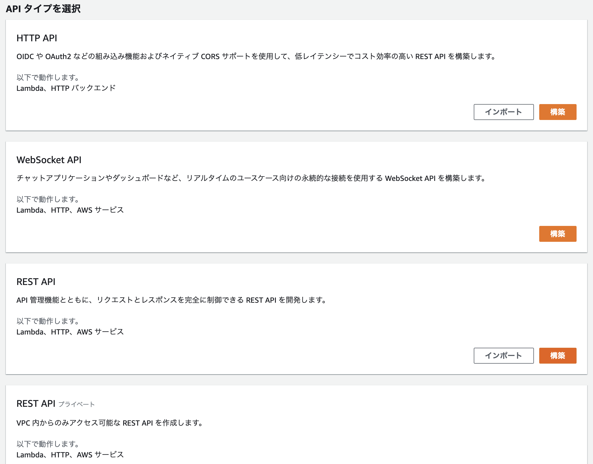
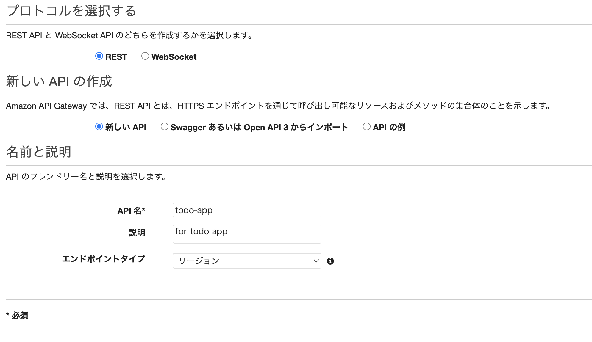
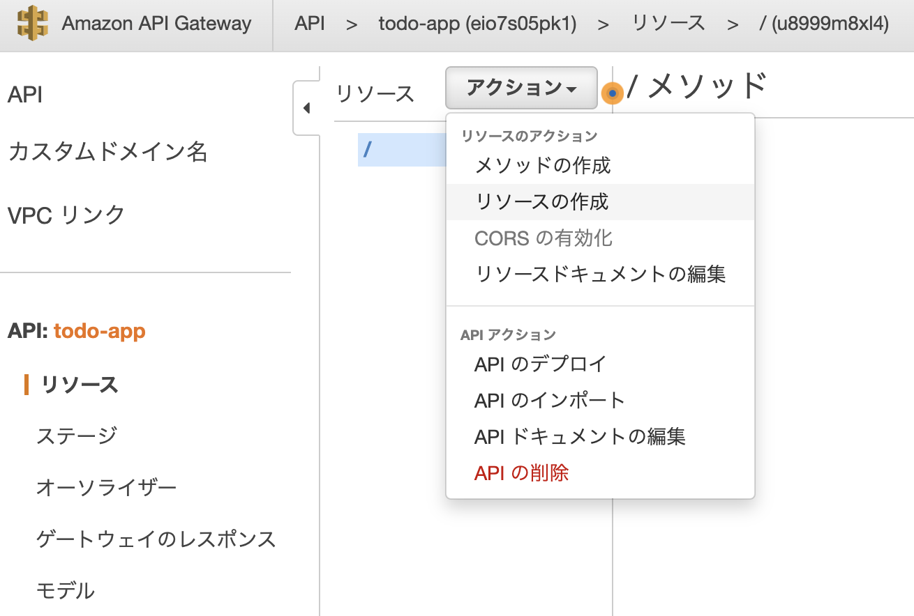
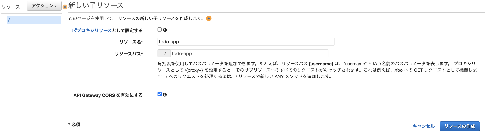
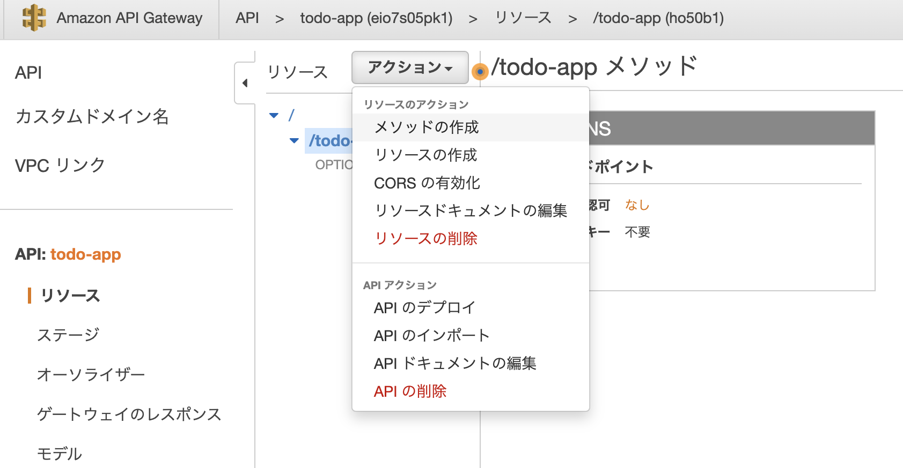
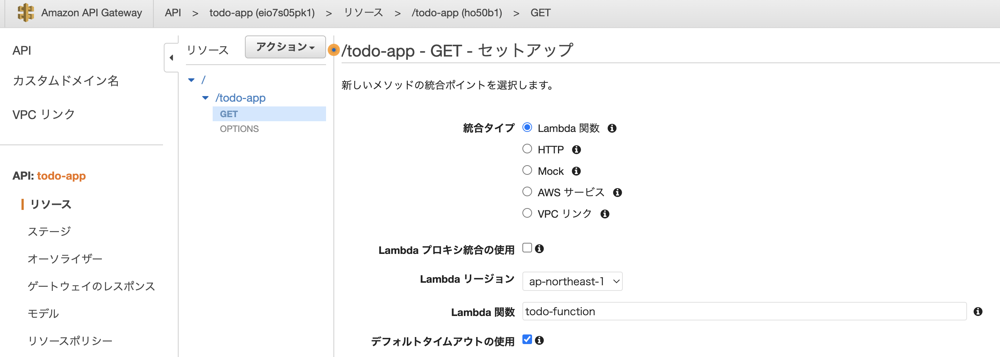
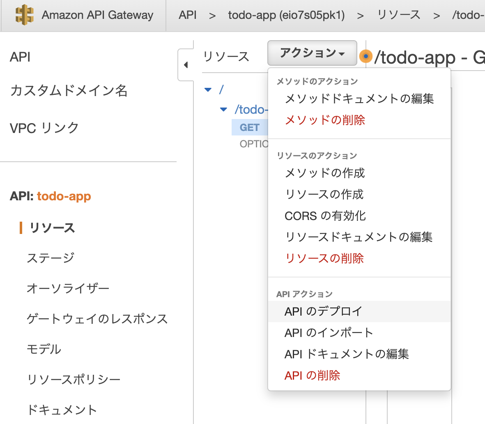
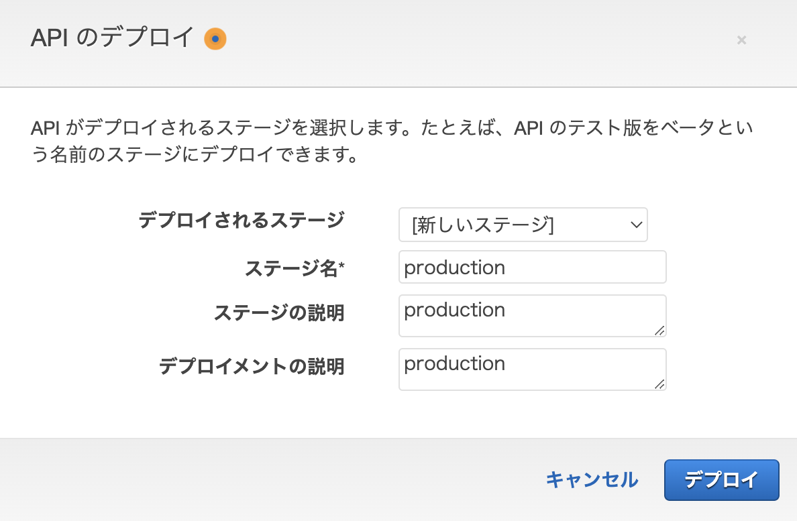
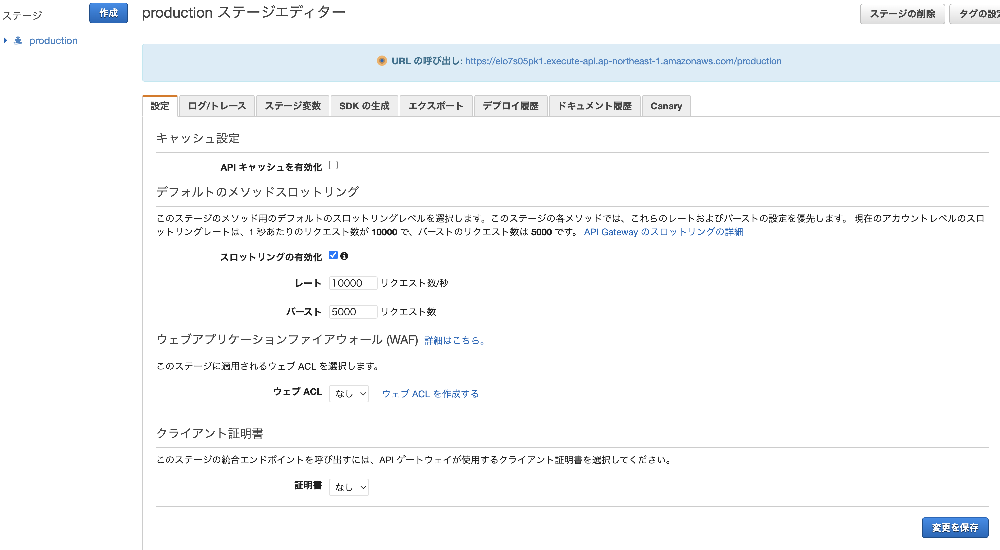

+++
title =  "API GatewayとLambdaとDynamoDBを組み合わせてToDoアプリを作る"
url = "2022-03-08"
date = "2022-03-08"
description = "API GatewayとLambdaとDynamoDBを組み合わせてToDoアプリを作る"
tags = [
  "AWS"
]
categories = [
  "AWS"
]
archives = "2022/03"
aliases = ["migrate-from-jekyl"]
+++

<br>

GatewayとLambdaとDynamoDBを組み合わせてToDoアプリを作る方法です。

Lambda 関数を作ります。


API GatewayでRestAPIを作ります。




アクションから「リソースの作成」を選択します。





アクションから「メソッドの作成」を選択します。



Getを選択し、先ほど作成したLambda関数と連携させます。



アクションから「APIのデプロイ」を選択します。



デプロイ先のステージを選択します。ステージがない場合は新しいステージを作成します。





作成されたステージ + メソッド名をブラウザに入力し、`"Hello from Lambda!"` と表示されることを確認します。
今回の場合は `https://eio7s05pk1.execute-api.ap-northeast-1.amazonaws.com/production/todo-app` となります。


DynamoDBを作ります。

```
aws dynamodb put-item \
--table-name todo-table \
--item '{ "todoMessage": { "S": "Clean My Room" }, "todoDate": { "S": "2022-03-20T00:00:00Z" } }' \
--profile sandbox
```

```
aws dynamodb put-item \
--table-name todo-table \
--item '{ "todoMessage": { "S": "Shopping" }, "todoDate": { "S": "2022-03-19T00:00:00Z" } }' \
--profile sandbox
```

```
aws dynamodb put-item \
--table-name todo-table \
--item '{ "todoMessage": { "S": "Programing" }, "todoDate": { "S": "2022-03-18T00:00:00Z" } }' \
--profile sandbox
```


```
aws dynamodb scan \
--table-name todo-table \
--limit 10 \
--profile sandbox | jq
```


```
aws dynamodb query \
--table-name todo-table \
--key-condition-expression "todoMessage = :todoMessage" \
--filter-expression 'attribute_not_exists(todoMessage)' \
--profile sandbox | jq

```

```
aws dynamodb scan \
--table-name todo-table \
--filter-expression 'attribute_not_exists(todoMessage2)' \
--profile sandbox | jq
```


```
aws dynamodb scan \
--table-name todo-table \
--filter-expression 'attribute_not_exists(todoMessage2)' \
--profile sandbox | jq
```


```
import json
import boto3


def lambda_handler(event, context):
    # TODO implement
    
    dynamodb = boto3.resource('dynamodb')
    table = dynamodb.Table('todo-table')
    response = table.scan()
    
    print(response['Items'])
    
    
    return {
        'statusCode': 200,
        'body': json.dumps(response['Items'])
    }
```