+++
title =  "API Gatewayに独自ドメインを設定する"
url = "2022-03-09"
date = "2022-03-09"
description = "API Gatewayに独自ドメインを設定する"
tags = [
  "AWS"
]
categories = [
  "AWS"
]
archives = "2022/03"
aliases = ["migrate-from-jekyl"]
+++

 

API Gatewayに独自ドメインを設定する方法です。

API Gateway用のLambda関数を作成します。

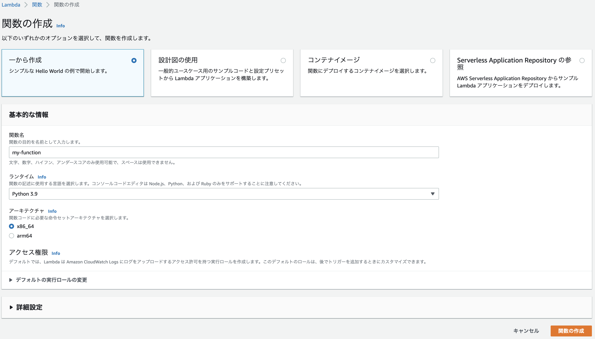

API GatewayでRestAPIを作ります。

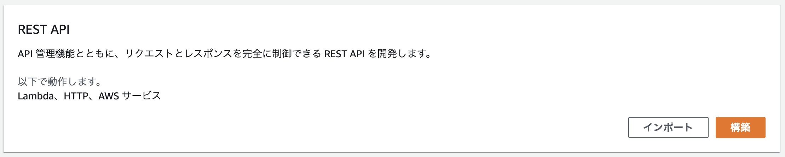

メソッドを作成します。先ほど作成した Lambda関数を設定します。

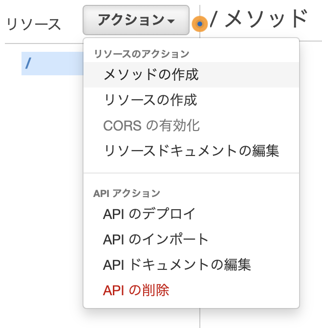

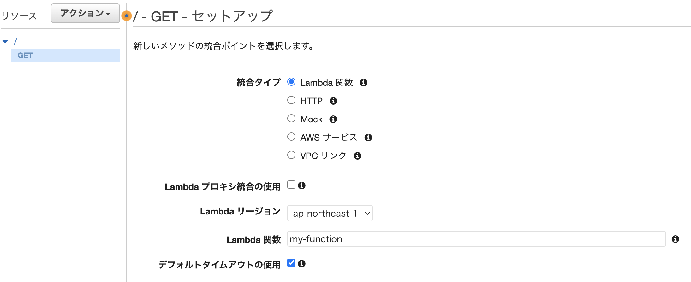

アクションから「APIのデプロイ」を選択します。

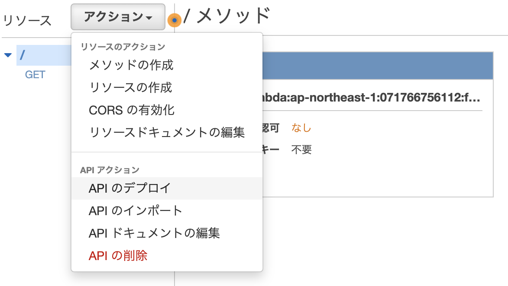

ステージが既に作られていない場合はステージを作成します。

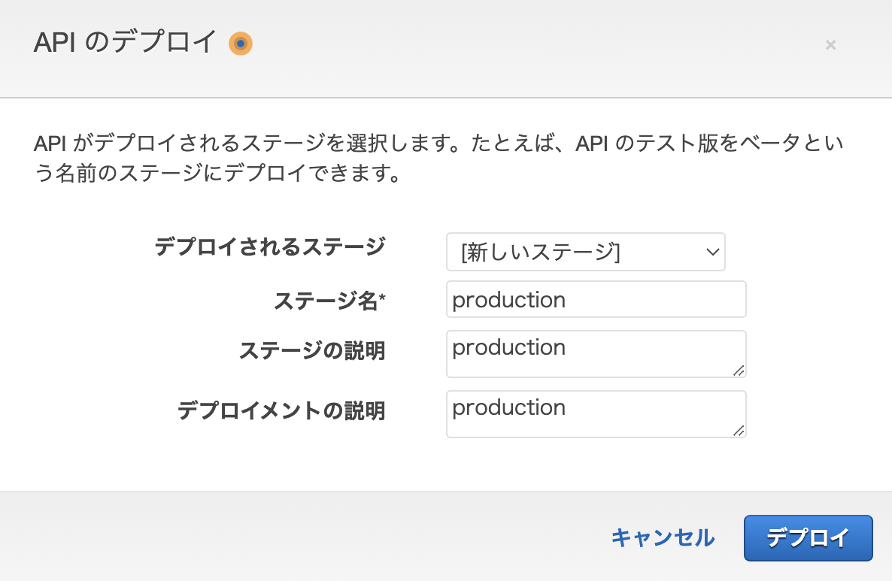

作成されたステージ + メソッド名をブラウザに入力し、`"Hello from Lambda!"` と表示されることを確認します。
今回の場合は `https://yyd1qtujv0.execute-api.ap-northeast-1.amazonaws.com/production` となります。

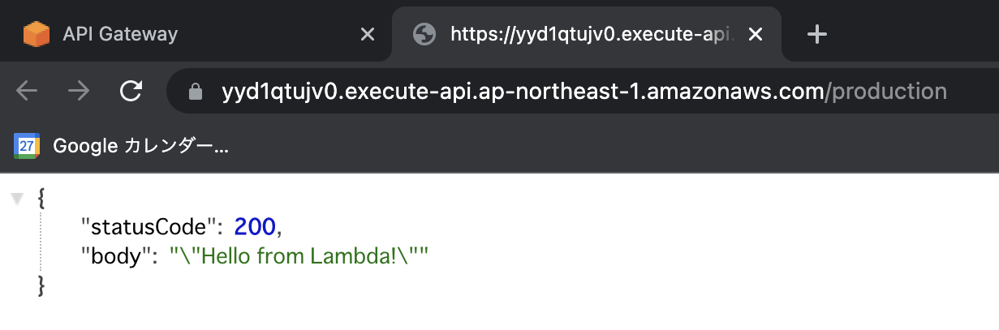

API Gateway でカスタムドメインを作成します。

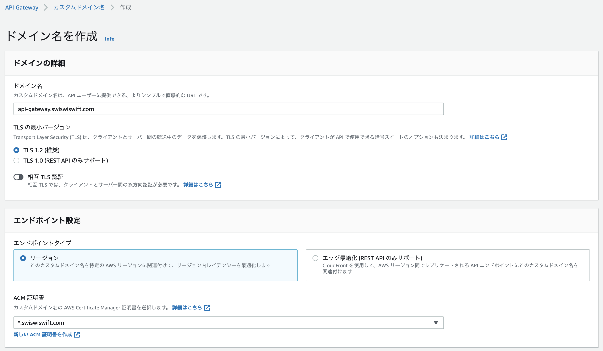

API マッピングです。

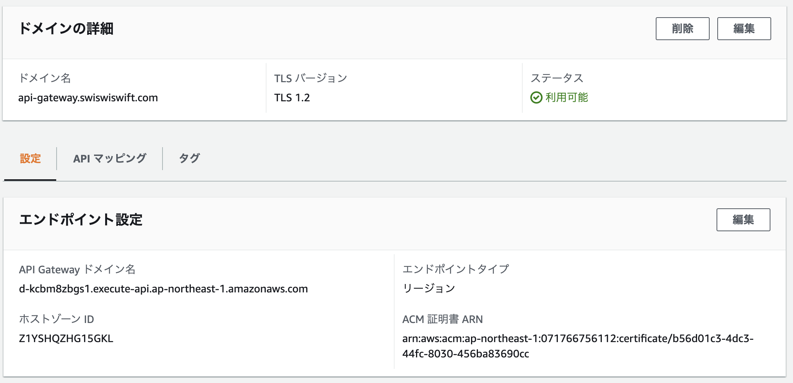

ルーティングポリシーを設定。

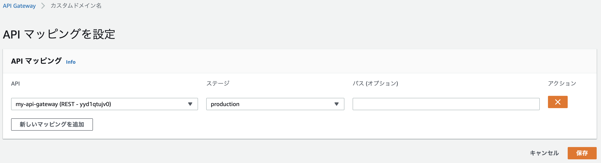

ルーティングポリシーを設定。

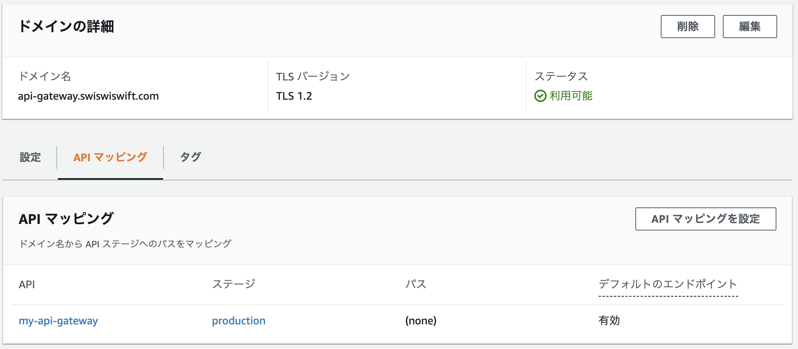

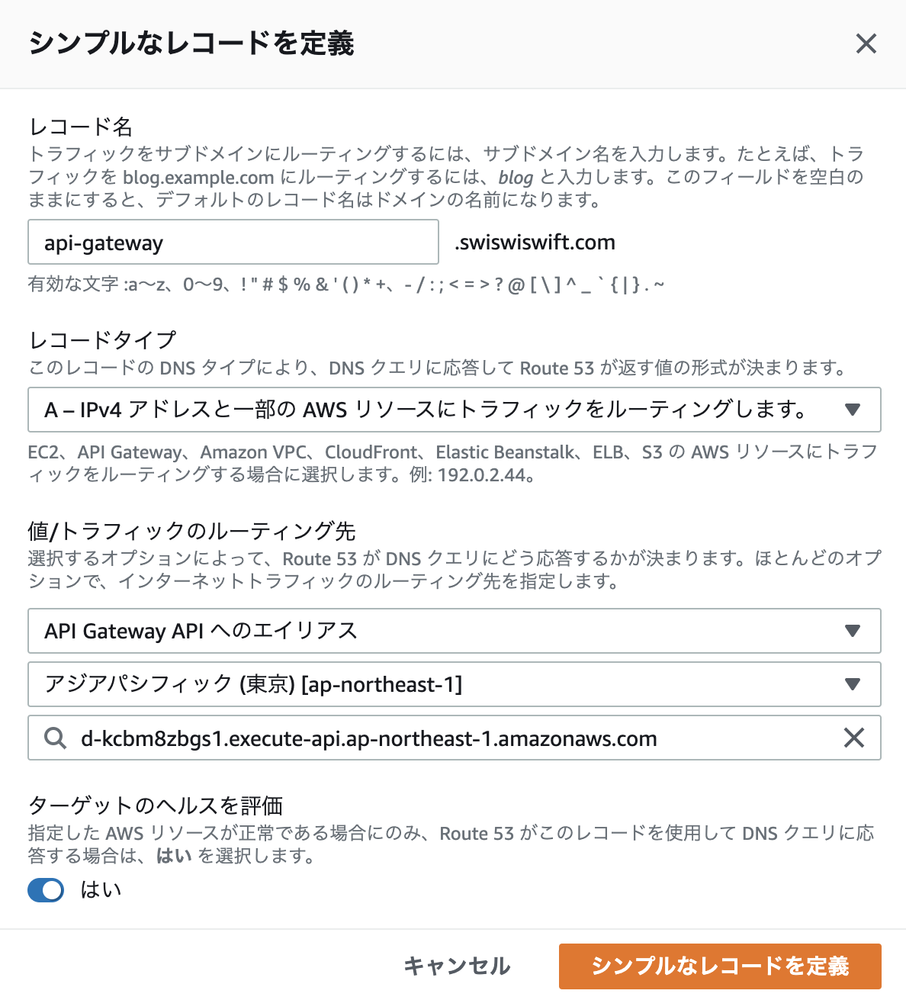

`https://api-gateway.swiswiswift.com/` にアクセスしてレスポンスが帰ることを確認します。

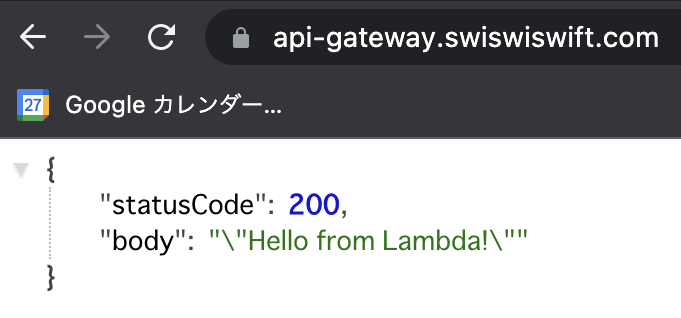
