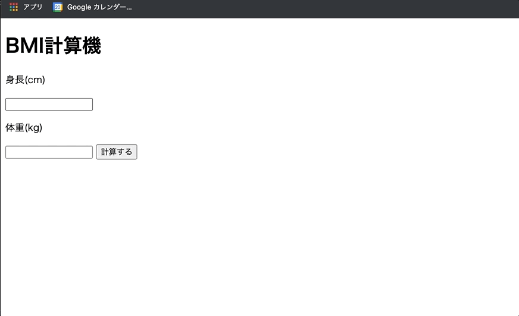

+++
title =  "JavaScriptでBMI計算機を作る"
url = "2022-05-03"
date = "2022-05-03"
description = "JavaScriptでBMI計算機を作る"
tags = [
  "JavaScript"
]
categories = [
  "JavaScript"
]
archives = "2022/05"
aliases = ["migrate-from-jekyl"]
+++

 

JavaScriptでBMI計算機を作る方法です。


