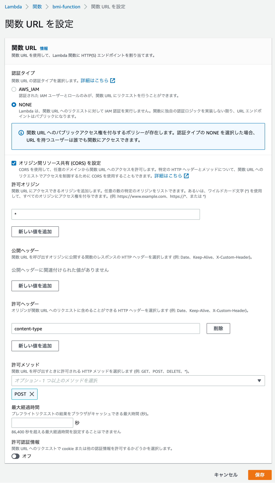

+++
title =  "LambdaでBMIを計算するAPIを作成してJSで呼び出す"
url = "2022-06-08"
date = "2022-06-08"
description = "LambdaでBMIを計算するAPIを作成してJSで呼び出す"
tags = [
  "AWS",
  "Python",
  "JavaScript"
]
categories = [
  "AWS",
  "Python",
  "JavaScript"
]
archives = "2021/06"
aliases = ["migrate-from-jekyl"]
+++

<br>

LambdaでBMIを計算するAPIを作成してJSで呼び出す方法です。
以下のコードをコードタブに貼り付け関数URLを作成します。


以下のcurlコマンドを実行し、bmiが計算されることを確認します。

```
curl -X POST -d '{"hight":170, "weight":60}' {ENDPOINT_URL}
```

```
{
  "bmi": 20.761245674740486
}
```

CORSの設定します。



次に `index.html` と `script.js` を作成します。
計算ボタンを押すとBMIが計算されるとBMIがアラートで表示されます。


