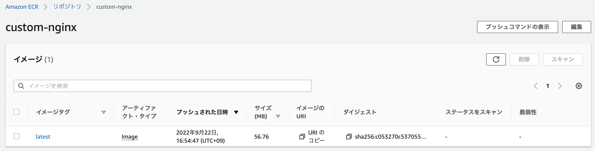
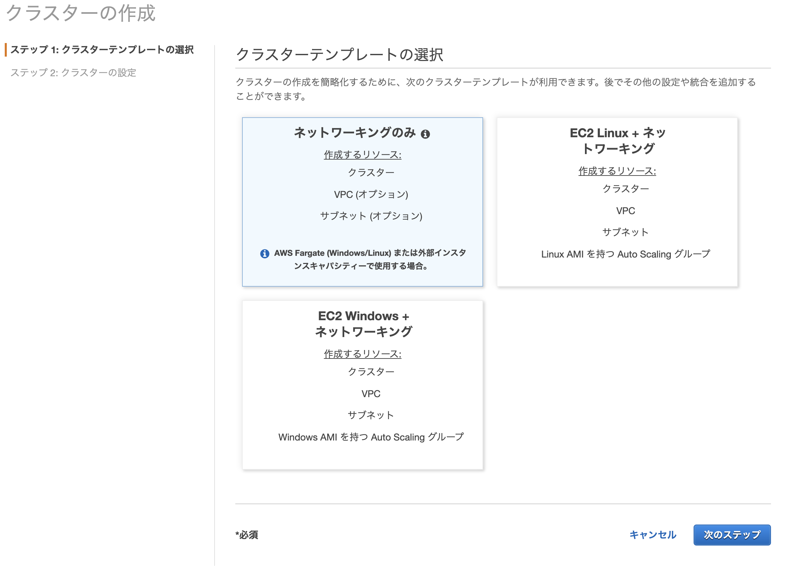
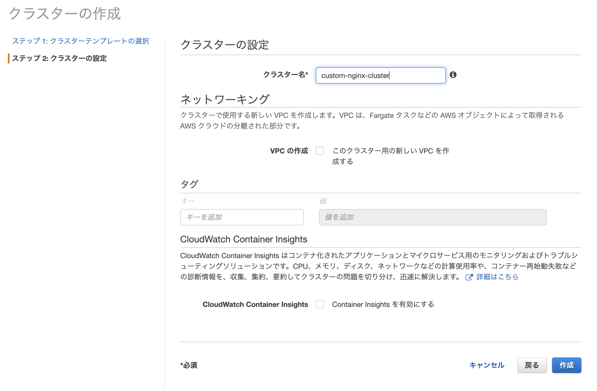
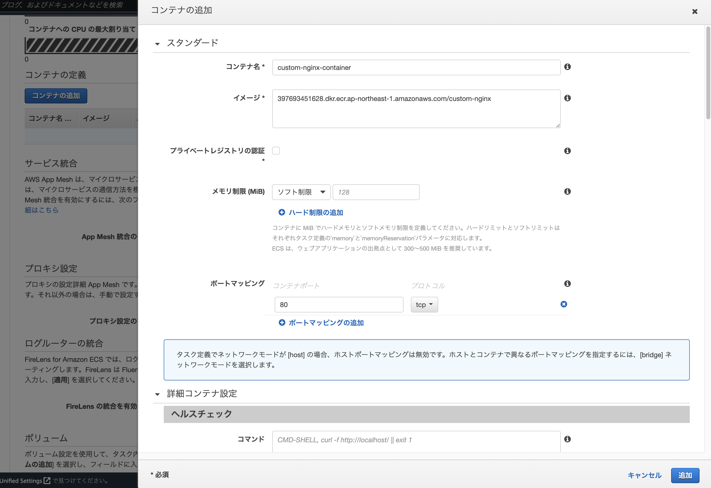
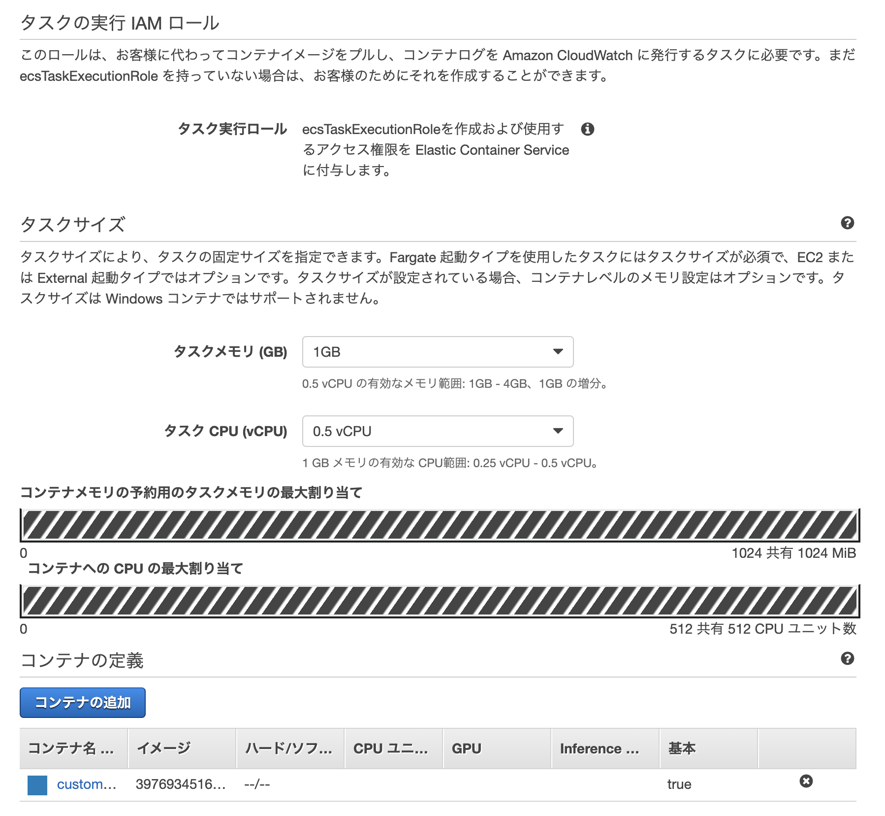
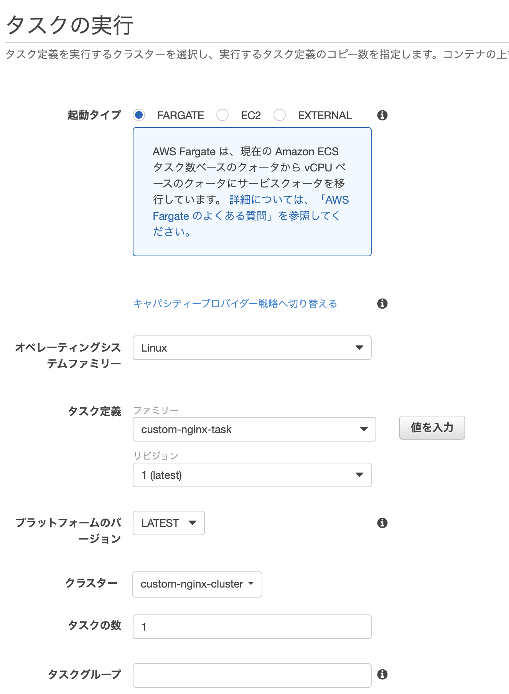
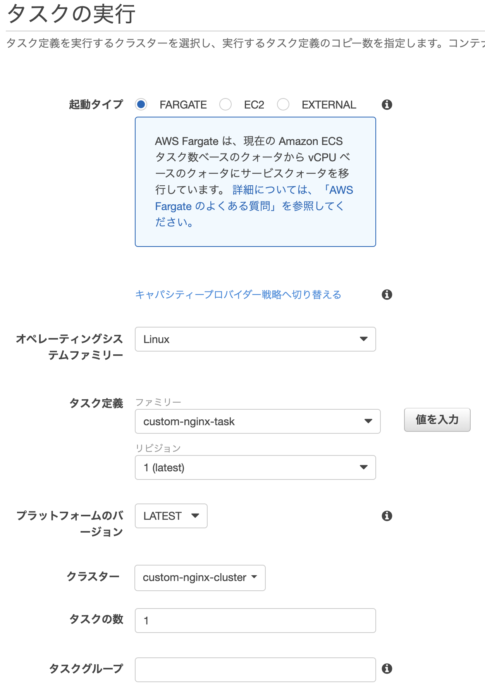
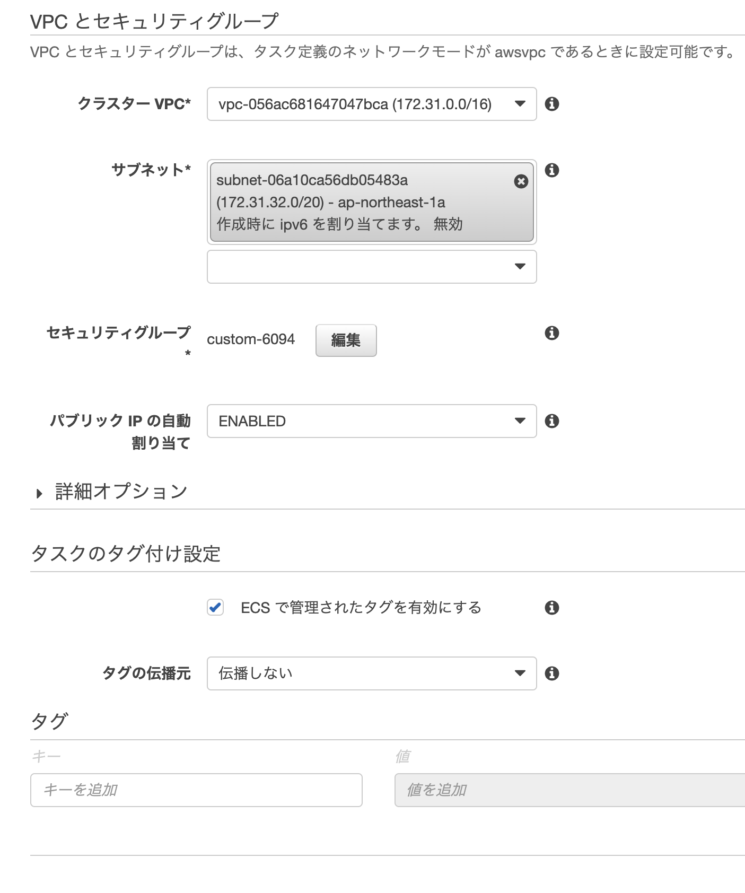

+++
title =  "Dockerイメージを作成してECSで動かす"
url = "2022-06-11"
date = "2022-06-11"
description = "Dockerイメージを作成してECSで動かす"
tags = [
  "Docker",
  "AWS"
]
categories = [
  "Docker",
  "AWS"
]
archives = "2021/06"
aliases = ["migrate-from-jekyl"]
+++

<br>

Dockerイメージを作成してECSで動かします。


## Dockerのおさらいとnginxイメージについて

nginxのイメージに手を加えてカスタムイメージを作成します。

nginxのイメージをプルします。

```
$ docker pull nginx:1.23.1
```

nginxのコンテナを動かし、ブラウザからlocalhostにアクセスします。
nginxのデモページが表示されることを確認します。

```
$ docker run --rm -p 80:80 nginx
```

`-d` オプションを付けるとバックグラウンドで動かすことができます。

```
$ docker run --rm -d -p 80:80 nginx
```

`docker logs` コマンドでコンテナのログを確認することができます。

```
$ docker logs コンテナID
```

以下のコマンドでDockerイメージの中に入ることができます。

```
$ docker run --rm -it nginx /bin/sh
```


## カスタムイメージの作成

nginxのデモページは `/usr/share/nginx/html` にあります。
以下のような `Dockerfile` と `index.html` を同じディレクトリに作成します。


```
FROM nginx

COPY index.html  /usr/share/nginx/html/index.html
```

```
<h1>Hello</h1>
```

イメージをビルドします。

```
$ docker build . -t custom-nginx
```

作成したイメージが動くか確認します。

```
$ docker run --rm -p 80:80 custom-nginx
```


## ECRへイメージをプッシュする。

ECRでリポジトリを作ります。



ログインします。

```
$ aws ecr get-login-password --region ap-northeast-1 | docker login --username AWS --password-stdin {AWS_ACCOUNT_ID}.dkr.ecr.ap-northeast-1.amazonaws.com
```

ビルドします。

```
$ docker build -t custom-nginx .
```

タグをつけます

```
$ docker tag custom-nginx:latest {AWS_ACCOUNT_ID}.dkr.ecr.ap-northeast-1.amazonaws.com/custom-nginx:latest
```

プッシュします。

```
$ docker push {AWS_ACCOUNT_ID}.dkr.ecr.ap-northeast-1.amazonaws.com/custom-nginx:latest
```


## ECSの作成

`custom-nginx-cluster` を作成します。





`custom-nginx-role` を作成します。
ECS FUll Access をアタッチします。
以下のような信頼関係を設定します。

```
{
  "Version": "2012-10-17",
  "Statement": [
    {
      "Effect": "Allow",
      "Principal": {
        "Service": [
          "ecs.amazonaws.com",
          "ecs-tasks.amazonaws.com"
        ]
      },
      "Action": "sts:AssumeRole"
    }
  ]
}
```

タスク定義、`custom-nginx-task` を作成します。
`custom-nginx-container` を作成します。










