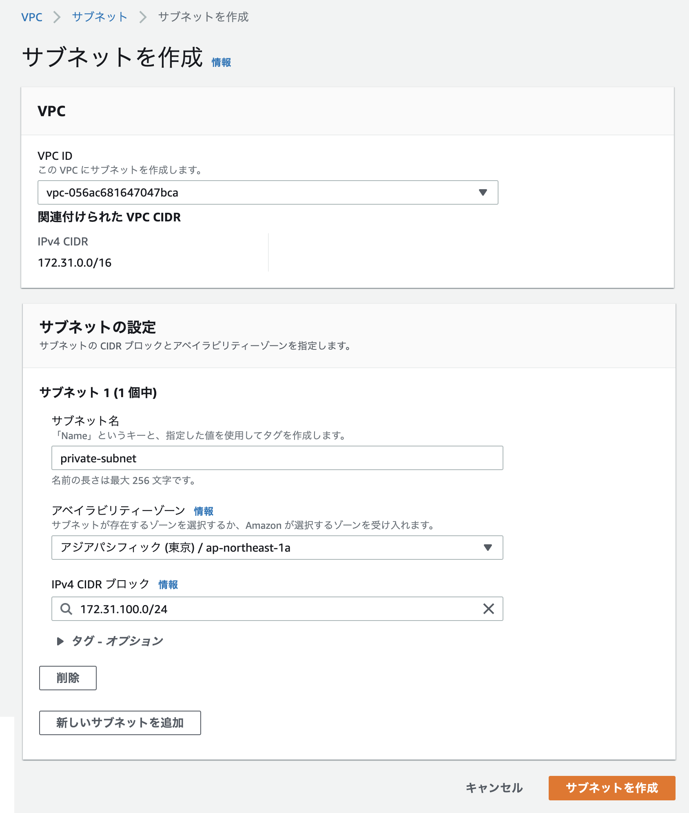
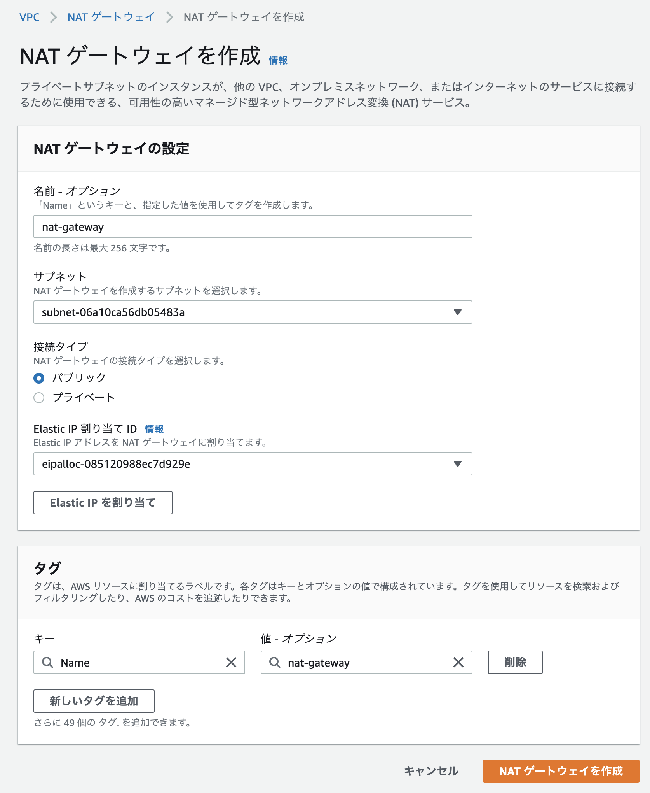
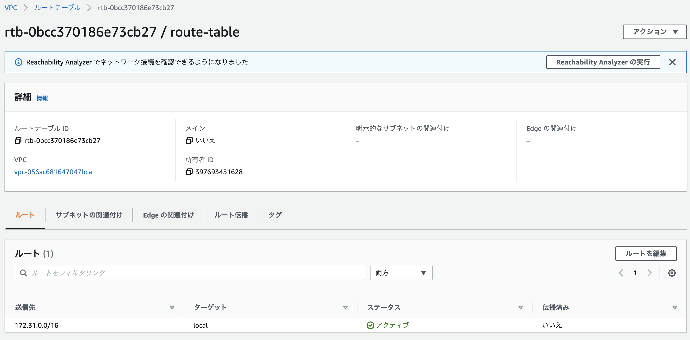

+++
title =  "AWSでEC2をプライベートサブネットに設置する"
url = "2022-06-12"
date = "2022-06-12"
description = "AWSでEC2をプライベートサブネットに設置する"
tags = [
  "AWS"
]
categories = [
  "AWS"
]
archives = "2021/06"
aliases = ["migrate-from-jekyl"]
+++

<br>

AWSでEC2をプライベートサブネットに設置する方法です。

Private-Subnetを作成します。




Private-SubnetにEC2インスタンスを作成します。
パブリックIPが無いため、外部からSSHすることはできません。

Public-Subnetに踏み台インスタンスをインスタンスを作成します。

```
$ ssh -i key-pair.pem ec2-user@{PUBLIC_EC2_IP}
```

scpでPublic-Instanceにキーペアを送信します。

```
$ scp -i key-pair.pem key-pair.pem ec2-user@{PUBLIC_EC2_IP}:/home/ec2-user/key-pair.pem
```

NATゲートウェイを作成します。



Routeテーブルの設定をします。



これでPublic-InstanceからPrivate-Instanceにアクセスすることができます。

```
$ ssh -i key-pair.pem ec2-user@{PRIVATE_EC2_IP}
```
