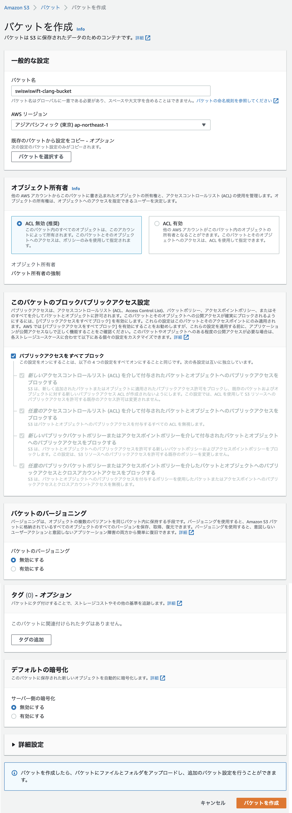

+++
title =  "CodeBuildでC言語をビルドする"
url = "2022-06-13"
date = "2022-06-13"
description = "CodeBuildでC言語をビルドする"
tags = [
  "AWS"
]
categories = [
  "AWS"
]
archives = "2021/06"
aliases = ["migrate-from-jekyl"]
+++

<br>

CodeBuildでC言語をビルドする方法です。

C言語を書き、`main.c` というファイル名で保存します。

```
#include <stdio.h>

int main(void){
    printf("Hello World!!");
}
```

以下のコマンドでビルドすることができます。

```
$ gcc main.c -o main
```

S3バケットを作成します。
コードをアップロードします。



コードビルドを作成します。
ソースはS3を設定します。
Buildspecは以下のように設定します。
CodeBuildのロールにはS3へのアクセス権を付与します。

```
version: 0.2

phases:
  build:
    commands:
      - gcc --version
      - ls
      - gcc main.c -o main
      - aws s3 cp main s3://swiswiswift-clang-bucket/output/main
```

ビルドを実行するとS3に実行結果がアップロードされます。
