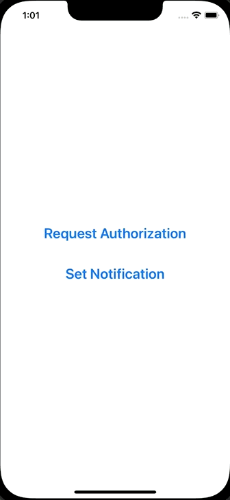

+++
title = "SwiftUIでローカル通知を送信する"
url = "2023-01-14"
date = "2023-01-14"
description = "SwiftUIでローカル通知を送信する"
tags = [
  "SwiftUI"
]
categories = [
  "SwiftUI"
]
archives = "2023/01"
aliases = ["migrate-from-jekyl"]
+++

 

SwiftUIでローカル通知を送信する方法です。
ローカル通知であればサーバーを用意しなくてもプッシュ通知を送信することができます。

参考: [【SwiftUI】通知機能の実装方法！ローカル通知とリモート通知の違い](https://tech.amefure.com/swift-notification)

<!-- Google Ads -->


<!-- Amazon Ads -->



