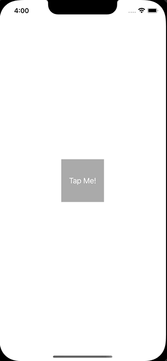

+++
title = "Swiftでモーダル表示時にviewWillDisappearが呼ばれない"
url = "2023-02-23"
date = "2023-02-23"
description = "Swiftでモーダル表示時にviewWillDisappearが呼ばれない"
tags = [
  "SwiftUI"
]
categories = [
  "SwiftUI"
]
archives = "2023/02"
aliases = ["migrate-from-jekyl"]
+++

 

Swiftでモーダル表示時にviewWillDisappearが呼ばれないということが起きました。
以下のようにボタンを押したタイミングでフルスクリーンのモーダルが表示されるとします。

`modalPresentationStyle` を `.fullScreen` にすると `viewWillDisappear` と `viewDidAppear` がモーダル表示のタイミングで呼ばれますが、`.overFullScreen` にすると `viewDidAppear` しか呼ばれませんでした。

参考: [iOSにおけるモーダル表示まとめ](https://blog.asial.co.jp/1669)

<!-- Google Ads -->


<!-- Amazon Ads -->




