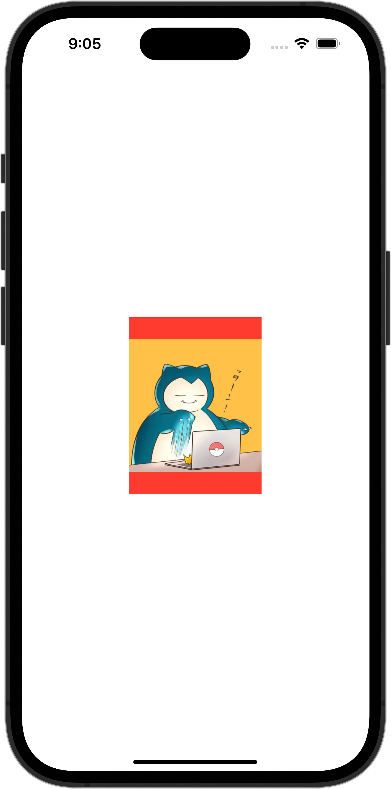

+++
title = "SwiftUIで画像をリサイズして表示（fit）"
url = "2023-10-01"
date = "2023-10-01"
description = "SwiftUIで画像をリサイズして表示（fit）"
tags = [
  "SwiftUI"
]
categories = [
  "SwiftUI"
]
archives = "2023/10"
aliases = ["migrate-from-jekyl"]
+++

 

### 1. 画像をリサイズして表示（fit）
150×200サイズに画像をリサイズして表示させてください。
アスペクト比が異なる場合は余白を赤色で表示してください。

