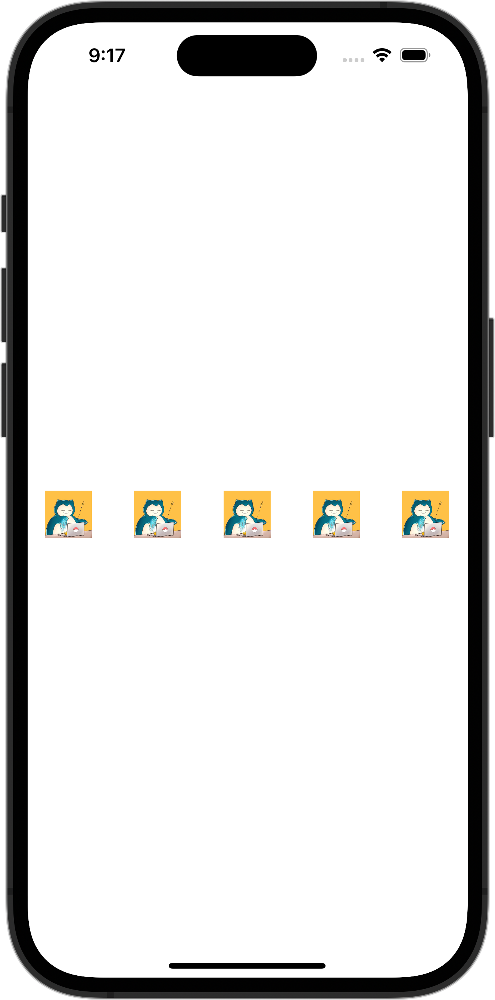

+++
title = "SwiftUIで画像を等間隔で横に並べる"
url = "2023-10-05"
date = "2023-10-05"
description = "SwiftUIで画像を等間隔で横に並べる"
tags = [
  "SwiftUI"
]
categories = [
  "SwiftUI"
]
archives = "2023/10"
aliases = ["migrate-from-jekyl"]
+++

 

SwiftUIで画像を等間隔で横に並べる方法です。
Spacerを使うことで等間隔にViewを並べることができます。


