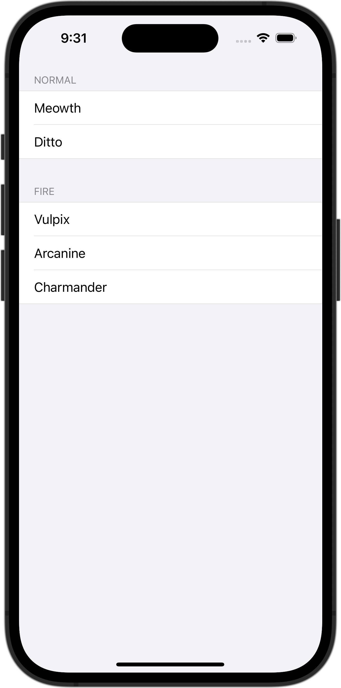

+++
title = "SwiftUIでListを使ってセクションごとに表示する"
url = "2023-10-06"
date = "2023-10-06"
description = "SwiftUIでListを使ってセクションごとに表示する"
tags = [
  "SwiftUI"
]
categories = [
  "SwiftUI"
]
archives = "2023/10"
aliases = ["migrate-from-jekyl"]
+++

 

SwiftUIでListを使ってセクションごとに表示する方法です。
Listの `listStyle` を指定して表示方法を変えています。


