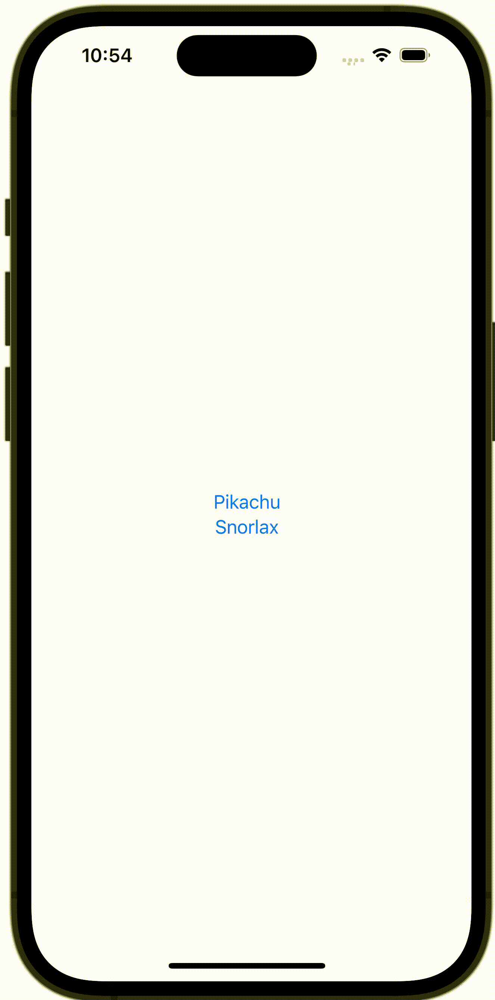

+++
title = "SwiftUIでAlertを出し分ける"
url = "2023-10-15"
date = "2023-10-15"
description = "SwiftUIでAlertを出し分ける"
tags = [
  "SwiftUI"
]
categories = [
  "SwiftUI"
]
archives = "2023/10"
aliases = ["migrate-from-jekyl"]
+++

 

SwiftUIでAlertを出し分ける方法です。
ボタン1が押されたらアラート1を、ボタン2が押されたらアラート2を表示してください


