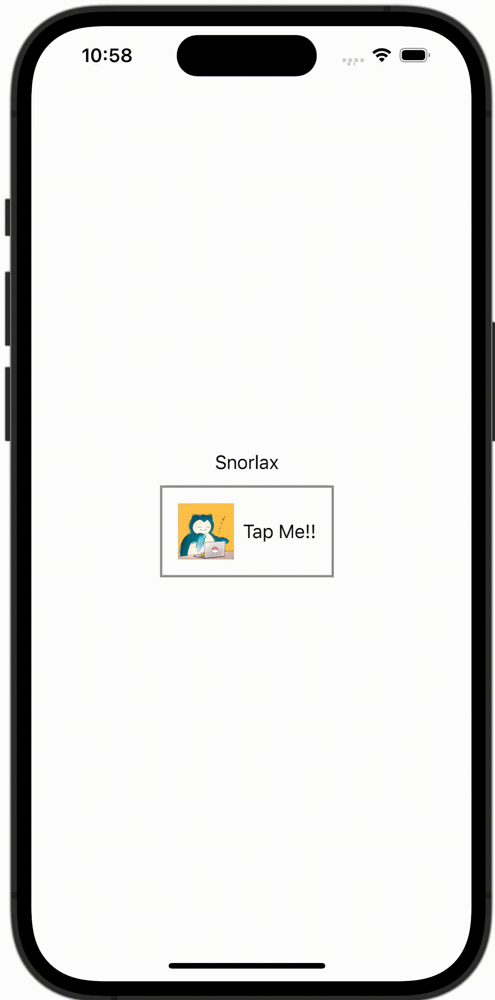

+++
title = "SwiftUIでButton内の画像やテキストの色を変えない"
url = "2023-10-16"
date = "2023-10-16"
description = "SwiftUIでButton内の画像やテキストの色を変えない"
tags = [
  "SwiftUI"
]
categories = [
  "SwiftUI"
]
archives = "2023/10"
aliases = ["migrate-from-jekyl"]
+++

 

SwiftUIでButton内の画像やテキストの色を変えない方法です。
`.buttonStyle(PlainButtonStyle())` を設定することでボタンを押した時の色を変えずに済みます。


