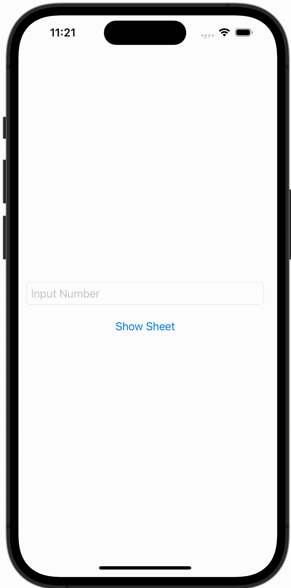

+++
title = "SwiftUIでアラートとシートを出し分ける"
url = "2023-10-17"
date = "2023-10-17"
description = "SwiftUIでアラートとシートを出し分ける"
tags = [
  "SwiftUI"
]
categories = [
  "SwiftUI"
]
archives = "2023/10"
aliases = ["migrate-from-jekyl"]
+++

 

SwiftUIでアラートとシートを出し分ける方法です。
数字が入力されたらシートを表示し、数字以外が入力されたらアラートを表示しています。


