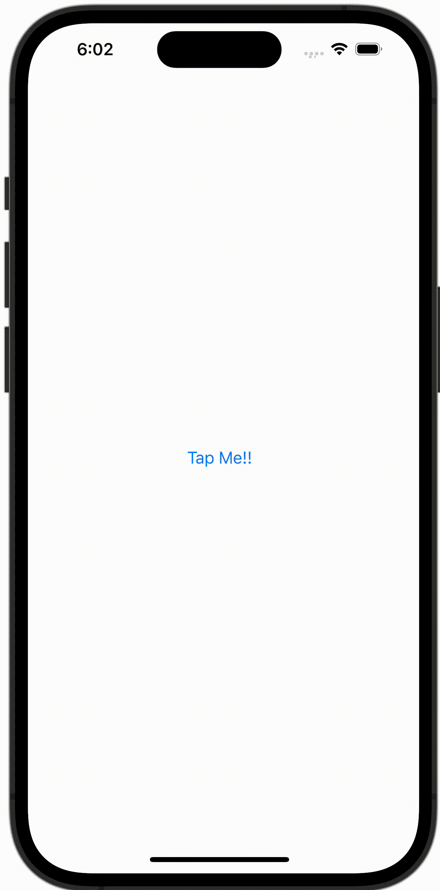

+++
title = "SwiftUIでButtonからプッシュ遷移をする（NavigationLinkを無効にする）"
url = "2023-10-18"
date = "2023-10-18"
description = "SwiftUIでButtonからプッシュ遷移をする（NavigationLinkを無効にする）"
tags = [
  "SwiftUI"
]
categories = [
  "SwiftUI"
]
archives = "2023/10"
aliases = ["migrate-from-jekyl"]
+++

 

SwiftUIでButtonからプッシュ遷移をする（NavigationLinkを無効にする）方法です。
NavigationLink を擬似的に無効にすることができます。


