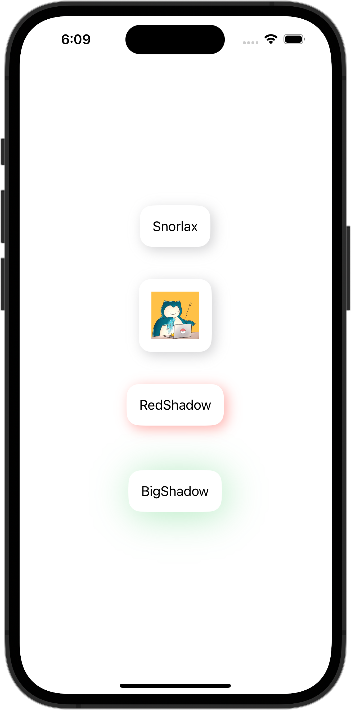

+++
title = "SwiftUIでViewModifierを使ってViewに影をつける"
url = "2023-10-06"
date = "2023-10-06"
description = "SwiftUIでViewModifierを使ってViewに影をつける"
tags = [
  "SwiftUI"
]
categories = [
  "SwiftUI"
]
archives = "2023/10"
aliases = ["migrate-from-jekyl"]
+++

 

SwiftUIで画像を丸く切り取り枠を付ける方法です。
150×200サイズに画像をリサイズして表示させています。
アスペクト比が異なる場合ははみ出た箇所を切り取って表示しています。


