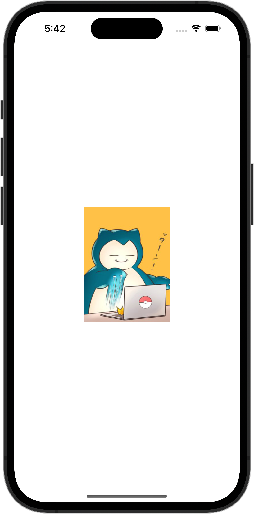

+++
title = "SwiftUIでリストのセルをタップするとアラートが表示させる"
url = "2023-10-24"
date = "2023-10-24"
description = "SwiftUIでリストのセルをタップするとアラートが表示させる"
tags = [
  "SwiftUI"
]
categories = [
  "SwiftUI"
]
archives = "2023/10"
aliases = ["migrate-from-jekyl"]
+++

 

SwiftUIでリストのセルをタップするとアラートが表示させる方法です。
リストのセルをタップするとアラートが表示させています。


