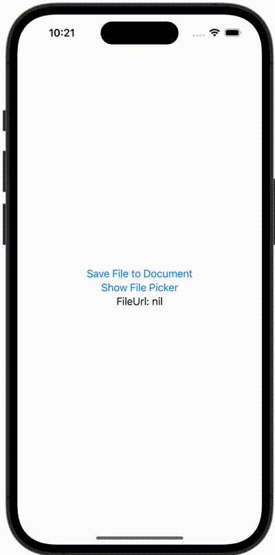

+++
title = "iOSのファイルアプリ（UIDocumentPickerViewController）を開いてドキュメントフォルダに保存したファイルを開く"
url = "2023-12-19"
date = "2023-12-19"
description = "iOSのファイルアプリ（UIDocumentPickerViewController）を開いてドキュメントフォルダに保存したファイルを開く"
tags = [
  "SwiftUI"
]
categories = [
  "SwiftUI"
]
archives = "2023/12"
aliases = ["migrate-from-jekyl"]
+++

 

iOSのファイルアプリ（UIDocumentPickerViewController）を開いてドキュメントフォルダに保存したファイルを開く方法です。


