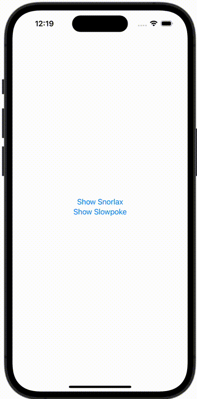

+++
title = "SwiftUIでシートを出し分ける"
url = "2024-01-02"
date = "2024-01-02"
description = "SwiftUIでシートを出し分ける"
tags = [
  "SwiftUI"
]
categories = [
  "SwiftUI"
]
archives = "2024/01"
aliases = ["migrate-from-jekyl"]
+++

 

SwiftUIでシートを出し分ける方法です。



