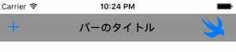

+++
title = "UIBarButtonItem"
url = "2017-05-04"
date = "2017-05-04"
description = "UIBarButtonItem"
tags = [
    "iOS",
]
categories = [
    "iOS",
]
archives = "2017/05"
aliases = ["migrate-from-jekyl"]
+++

<br>

UINavigationBarの要素追加、カスタマイズに用いられるUIBarButtonItemについてです。

UIBarButtonItemのクラス階層

NSObject  
↑  
UIBarItem  
↑  
UIBarButtonItem  
[AppleDeveloperリファレンスUIBarButtonItem](https://developer.apple.com/documentation/uikit/uibarbuttonitem)

UIBarButtonItem例文

UINavigationBarを生成し、タイトルとボタンを付けます。






UIBarButtonItemの色の変更

UIBarButtonItemはデフォルトでは青色ですが、以下の方法で色を指定することができます。  
Change color of Back button in navigation bar

```
//ナビゲーションボタンの色を変更する
UINavigationBar.appearance().tintColor = UIColor.black
UIBarButtonSystemItem
```

UIBarButtonSystemItemを用いることで、デフォルトに入っているボタンを使用することができます。  
https://developer.apple.com/reference/uikit/uibarbuttonsystemitem

```
//barButtonSystemItem:に  [.add]を設定することで[+]ボタンを設定する,上のコード参照
let leftNavBtn =  UIBarButtonItem(barButtonSystemItem:  .add, target: self, action: #selector(leftBarBtnClicked(sender:)))
```

- Add
- Done
- Cancel
- Edit
- Save
- Compose
- Reply
- Action
- Organize
- Bookmarks
- Search
- Refresh
- Stop
- Camera
- Trash
- Play
- Pause
- Rewind
- Undo
- Redo
- PageCurl

<!-- Google Ads -->


<!-- Amazon Ads -->

